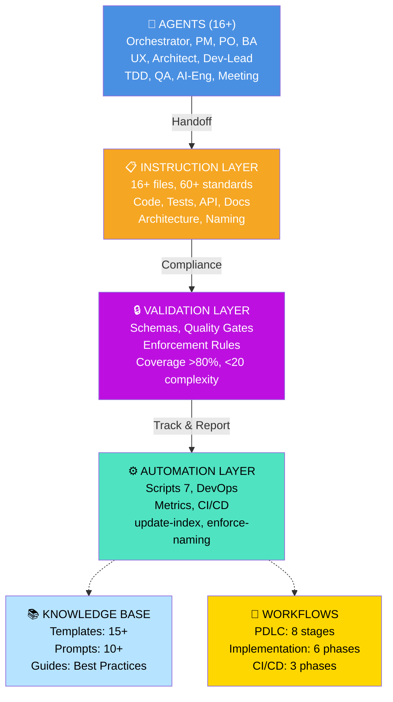
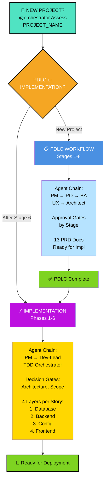

# .github Toolbox - Complete Index (Framework 2.0.1 Enterprise Edition)

**Complete AI-driven PDLC Orchestration System** with 16+ specialized agents, 20+ instruction guidelines, workflow automation, quality enforcement, and enterprise DevOps infrastructure. Production-ready framework for orchestrating multi-agent AI to drive full software development lifecycle with BDD-driven TDD, debugging workflows, and maximum agent productivity.

---

## 🚀 Quick Start

```bash
@orchestrator Assess project status for [PROJECT_NAME]
```

---

## 📂 Directory Structure & Contents

### 🤖 [agents/](agents/) - AI Agents (16+ specialized roles)

**Extended handoff chain**: Orchestrator → PM → PO → BA → UX → Architect → Dev-Lead → TDD Agents + Domain Specialists (QA, AI Engineering, Meeting Assistant)

| Agent | File | Role | Key Responsibilities | Availability |
|-------|------|------|----------------------|-----------------|
| **Orchestrator** | [orchestrator.agent.md](project-template/.github/agents/orchestrator.agent.md) | Master coordinator | Decision gates, handoff sequencing, workflow orchestration, quality gates, escalation | All stages |
| **Project Manager** | [project-manager.agent.md](project-template/.github/agents/project-manager.agent.md) | Sprint master | Sprint planning, capacity planning, velocity tracking, risk management | S1, S6, S8 |
| **Product Owner** | [product-owner.agent.md](project-template/.github/agents/product-owner.agent.md) | Requirements authority | Feature prioritization, stakeholder alignment, acceptance criteria, roadmap | All stages |
| **Business Analyst** | [ba.agent.md](project-template/.github/agents/ba.agent.md) | Analysis & testing | BDD scenarios, failure debugging, step definitions, implementation validation | S2, S5, S7 |
| **UX Designer** | [ux.agent.md](project-template/.github/agents/ux.agent.md) | Design authority | User journeys, wireframes, design systems, accessibility, component patterns | S3, S4 |
| **Solution Architect** | [architect.agent.md](project-template/.github/agents/architect.agent.md) | Architecture master | System design, tech choices, infrastructure, scalability decisions | S1-S4, S6, S8 |
| **Dev Lead** | [dev-lead.agent.md](project-template/.github/agents/dev-lead.agent.md) | Implementation lead | Layer-by-layer plans, handoff files, code quality, exception handling | S4, S5, S7 |
| **TDD Orchestrator** | [dev-tdd.agent.md](project-template/.github/agents/dev-tdd.agent.md) | TDD sequencer | Coordinates RED→GREEN→REFACTOR cycles, test coverage validation | S7 |
| **TDD RED** | [dev-tdd-red.agent.md](project-template/.github/agents/dev-tdd-red.agent.md) | Failing test author | BDD test creation, failure analysis, edge case discovery | S7 |
| **TDD GREEN** | [dev-tdd-green.agent.md](project-template/.github/agents/dev-tdd-green.agent.md) | Code implementer | Minimal code to pass tests, edge case handling | S7 |
| **TDD REFACTOR** | [dev-tdd-refactor.agent.md](project-template/.github/agents/dev-tdd-refactor.agent.md) | Quality optimizer | Refactoring, test optimization, debugging patterns, architecture cleanup | S7 |
| **QA Agent** | [qa.agent.md](project-template/.github/agents/qa.agent.md) | Quality assurance | Comprehensive testing, regression validation, performance testing, compliance checks | S5, S7, S8 |
| **AI Engineering Agent** | [ai-engineering.agent.md](project-template/.github/agents/ai-engineering.agent.md) | Infrastructure master | System architecture, AI pipeline optimization, performance tuning, DevOps | All |
| **Meeting Assistant** | [meeting.assistant.agent.md](project-template/.github/agents/meeting.assistant.agent.md) | Meeting facilitator | Meeting coordination, minutes capture, action items, stakeholder communication | Cross-phase |

**Legend**: S = Stage (S1-8 per PDLC Workflow)

---

### 📋 [workflows/](project-template/.github/workflows/) - Orchestration Workflows (5+ files)

**Complete workflow system** orchestrating 8-stage PDLC, 6-phase implementation, and 3-phase CI/CD.

| Workflow | File | Description | Phases/Stages |
|----------|------|-------------|---|
| **PDLC Workflow** | [documents.workflows.md](project-template/.github/workflows/documents.workflows.md) | 8-stage Product Development Lifecycle: Requirements → Analysis → Design → Planning → Testing → Deployment → Development → Improvement | 8 stages |
| **Assessment Workflow** | [assessment.workflows.md](project-template/.github/workflows/assessment.workflows.md) | Initial project health assessment, maturity scoring, recommendation engine | Pre-PDLC |
| **Implementation Workflow** | [implementation.workflows.md](project-template/.github/workflows/implementation.workflows.md) | 6-phase TDD execution: Epic Review → Sprint Planning → BDD Integration → TDD Cycle → BDD Validation → Code Quality | 6 phases |
| **CI/CD Workflow** | [cicd.workflows.md](project-template/.github/workflows/cicd.workflows.md) | 3-phase continuous integration: Bootstrap → Stabilization → Optimization | 3 phases |
| **GitHub Actions** | [ci.yml](project-template/.github/workflows/ci.yml) | Automated CI/CD pipeline triggers, build automation, deployment | Auto-triggered |

---

### 📚 [instructions/](project-template/.github/instructions/) - Development Standards (16+ files)

Comprehensive mandatory guidelines enforced across all development phases.

| Category | Files | Coverage |
|----------|-------|----------|
| **Code Quality** | coding.instructions.md, code-review.instructions.md, code-comments.instructions.md | SOLID principles, TDD, coverage >80%, cyclomatic complexity, 13-point review checklist, exception handling |
| **Testing Strategy** | test-strategy.instructions.md, bdd-testing.instructions.md | BDD patterns, failure debugging, comprehensive test strategies |
| **API Standards** | api-design.instructions.md | RESTful design, OpenAPI specs, versioning, error handling |
| **Documentation** | documentation.instructions.md, documentation-index.instructions.md, glossary-maintenance.instructions.md | Content scope, templates, Mermaid/PlantUML diagrams, terminology consistency |
| **Architecture** | project-structure.instructions.md, epic-user-story-organization.instructions.md | Folder layouts, naming conventions, story org, dependency management |
| **Naming & Conventions** | naming-conventions.instructions.md, terminology.instructions.md | Consistent identifier patterns (EPIC-xxx, US-xxx), glossary standards |
| **Operational** | agent-logging.instructions.md, pru-optimization.instructions.md, ai.analysis.guardrails.instructions.md, meeting-reports.instructions.md | PRU tracking, token optimization, analysis safety, meeting documentation |

---

### 🎨 [templates/](project-template/.github/templates/) - Document Templates (15+ files)

**Reusable templates** ensuring consistency across all documentation and handoffs.

| Category | Templates | Purpose |
|----------|-----------|---------|
| **Requirements & Planning** | user-story-tmpl.md, epic-tmpl.md, prerequisites-tmpl.yml | Structure for epics, stories, and dependency capture |
| **Implementation** | implementation-plan-tmpl.md, user-story-folder-tmpl.md, approval-block-tmpl.md | Layer-by-layer planning, story folder structure, plan approval gates |
| **BDD & Testing** | bdd-scenario-tmpl.md, tdd-execution-tmpl.md | Feature files, cycle tracking |
| **Handoffs & Communication** | handoff-tmpl.md, agent-log-tmpl.md, delta-summary-tmpl.md | Agent coordination, action logging, change tracking |
| **Compliance** | plan-approval-tmpl.yaml, pull-request-template.md | Human validation gates, Gen-E2 PR compliance |
| **Documentation** | index.md | INDEX.md generation template for doc hierarchies |

---

### 🎯 [tasks/](project-template/.github/tasks/) - Workflow Launchers (15+ files)

**Reusable prompt starters** for initiating workflows. Copy, fill parameters, invoke agent.

| Task Category | Files | Purpose | Invocation |
|--------------|-------|---------|-----------|
| **Assessment** | assess-project-status.prompt.md | Full project health check, maturity analysis, recommendations | `@orchestrator Assess project status for [PROJECT]` |
| **PDLC Kickoff** | start-pdlc.prompt.md, start-legacy-replatforming.prompt.md, start-gen-e2-project.prompt.md | Initialize new projects, legacy modernization, Gen-E2 platforms | `@orchestrator [Copy/fill prompt]` |
| **Implementation** | start-implementation.prompt.md | Begin execution phase after PDLC Stage 6 | `@orchestrator [Copy/fill prompt]` |
| **Testing & Debugging** | write-tests.prompt.md, bdd-test-runner.prompt.md, debug-bdd-failure.prompt.md | BDD scenario creation, test execution, failure analysis | `@ba [Copy/fill prompt]` |
| **Maintenance & Updates** | session-context-update.prompt.md, validate-implementation-and-update-status.prompt.md, index-update.prompt.md | Session tracking, progress validation, documentation updates | `@orchestrator [Copy/fill prompt]` |
| **DevOps & Automation** | branch-create-push.prompt.md, new-meeting-folder.prompt.md, meeting-minutes.prompt.md | Git workflow, meeting coordination, meeting record capture | `@ai-engineering [Copy/fill prompt]` |
| **Documentation** | quick-reference.prompt.md, overview.prompt.md | Quick lookups, system navigation, context retrieval | `@orchestrator [Copy/fill prompt]` |

---

### 💡 [prompts/](prompts/) - Reusable Prompt Library (7 files)

General-purpose prompts for common tasks, referenced by agents. Includes BDD debugging and agent productivity patterns.

| Prompt | File | Purpose |
|--------|------|---------|
| **Agent Prompt Library** | [agent-prompt-library.md](prompts/agent-prompt-library.md) | Collection of agent-specific prompt patterns |
| **Documentation Prompts** | [documentation.prompts.md](prompts/documentation.prompts.md) | Parameterized prompt for all documentation types (7 parameters) |
| **Overview Prompts** | [overview.prompts.md](prompts/overview.prompts.md) | System overview and navigation prompts |
| **TDD Prompts** | [tdd.prompts.md](prompts/tdd.prompts.md) | RED-GREEN-REFACTOR cycle guidance, exception patterns |
| **BDD Debugging Prompts** | [bdd-debugging.prompts.md](prompts/bdd-debugging.prompts.md) | Step failure analysis, exception handling patterns |
| **Agent Productivity** | [agent-productivity.prompts.md](prompts/agent-productivity.prompts.md) | Context optimization, project-specific conventions caching |
| **Planning Prompts** | [plan-us.prompts.md](prompts/plan-us.prompts.md) | User story planning and layer breakdown |

---

### ⚙️ [scripts/](project-template/.github/scripts/) - Automation & DevOps Tools (7 files)

**Enterprise automation suite** for build, validation, and infrastructure management.

| Script | Language | Purpose | Usage |
|--------|----------|---------|-------|
| **update-index.mjs** | ESM Node.js | Generate/update INDEX.md across doc hierarchy | `node .github/scripts/update-index.mjs [target-dir]` |
| **enforce-naming.mjs** | ESM Node.js | Validate EPIC-xxx, US-xxx naming patterns on branches/commits | `node .github/scripts/enforce-naming.mjs [--branch] [--commits]` |
| **migrate-structure.mjs** | ESM Node.js | One-time legacy structure migration | `node .github/scripts/migrate-structure.mjs [--dry-run]` |
| **collect-metrics.js** | Node.js | CI/CD pipeline performance analytics | `node .github/scripts/collect-metrics.js` |
| **collect-variant-metrics.js** | Node.js | A/B testing metrics for prompt variants | `node .github/scripts/collect-variant-metrics.js` |
| **promote-variant.js** | Node.js | Promote high-performing prompt to production | `node .github/scripts/promote-variant.js [--variant-id]` |
| **validate-prompts.js** | Node.js | Schema validation for all prompts | `node .github/scripts/validate-prompts.js` |

---

### 📋 [schemas/](project-template/.github/schemas/) - JSON Validation (3 files)

**Typed validation schemas** ensuring data integrity throughout workflow.

| Schema | Purpose | Enforced On |
|--------|---------|---|
| **decision_log.schema.json** | Decision gate tracking (options, rationale, approvals) | Decision points, escalations |

| **story.schema.json** | User story structure (criteria, scenarios, dependencies) | Story creation, updates |

---

### 🔒 [validation/](project-template/.github/validation/) - Workflow Enforcement (5+ files)

**Quality gates and compliance system** with auto-activation and expert overrides.

| Document | Purpose | Mode |
|----------|---------|------|
| **workflow-enforcer.md** | Core engine: auto-activation rules, quality checks, escalation | MANDATORY |
| **workflow-compliance.yml** | Configuration: Guidance-only / Balanced / Strict modes | Per-project |
| **enforcement-examples.md** | Real-world scenarios, resolutions, patterns | Reference |
| **override-mechanisms.md** | Expert bypasses with justification & risk assessment | Escalation |
| **enforcement-guide.md** | User guide for compliance system | Troubleshooting |

---

### 📊 [quality/](project-template/.github/quality/) - Metrics & Quality Control (2 files)

**Real-time quality dashboard and compliance validation**.

| File | Purpose | Key Metrics |
|------|---------|---|
| **quality-metrics.md** | Live dashboard (coverage, pass rate, cycle time, gate violations) | Coverage % / Pass Rate / Cycle Time / Violations |
| **validation-rules.yml** | Automated checks (>80% coverage, <20 complexity) | Code metrics / Architecture / Business rules |

---

### 📚 [guides/](project-template/.github/guides/) - Best Practices & Reference (3 files)

**Strategic guidance for team productivity and system optimization**.

| Guide | Purpose | For Whom |
|-------|---------|----------|
| **context-optimization-strategy.md** | Token efficiency patterns for AI agents (compression techniques, batching, caching) | Dev Leads, AI Engineers |
| **tdd-enforcement.guide.md** | RED-GREEN-REFACTOR discipline, BDD scenario patterns, failure debugging | TDD Agents, QA |
| **diagram-usage.guide.md** | Mermaid/PlantUML standards for architecture, sequence, and flow diagrams | Architects, BA |

---

### 🔗 [conflicts/](project-template/.github/conflicts/) - Authority & Conflict Resolution (1 file)

**Decision authority matrix and conflict escalation procedures**.

| Document | Purpose |
|----------|---------|
| **authority-matrix.yml** | RACI matrix: who decides on architecture, scope, quality gates, timeline | Reference |

---

### 📄 [copilot-instructions.md](copilot-instructions.md)

**Master instructions file** - Complete system architecture, orchestration rules, TDD workflow, folder structure, progress tracking.

**READ THIS FIRST** for full system understanding.

---

## 🎯 How to Use This Toolbox

### 1️⃣ Starting Work
```bash
@orchestrator Assess project status for [PROJECT_NAME]
```
Shows what exists, what's missing, and recommends next workflow.

### 2️⃣ Starting New PDLC
Copy prompt from [start-pdlc.prompts.md](tasks/start-pdlc.prompts.md), fill parameters, invoke:
```bash
@orchestrator [Your filled prompt]
```

### 3️⃣ Starting Implementation (after PDLC complete)
Copy prompt from [start-implementation.prompts.md](tasks/start-implementation.prompts.md), invoke:
```bash
@orchestrator [Your filled prompt]
```

### 4️⃣ Following Handoffs
- Each agent reads their agent file for responsibilities
- Agents coordinate through handoff files in `/docs/user-stories/<US-REF>/`
- One agent at a time works on shared files
- User makes decisions at **decision gates** (3 options presented)

### 5️⃣ TDD Cycles
Dev-Lead creates implementation plan → TDD-Orchestrator sequences RED→GREEN→REFACTOR → BA validates with BDD
**BDD Debugging**: When steps fail, BA uses [debug-bdd-failure.prompts.md](tasks/debug-bdd-failure.prompts.md) to analyze patterns and guide fix strategy

### 6️⃣ Checking Coding Standards
Before committing code, review [instructions/coding.instructions.md](instructions/coding.instructions.md) - 13-point checklist included.

### 7️⃣ Generating Documentation
Use [prompts/documentation.prompts.md](prompts/documentation.prompts.md) with 7 parameters for any doc type.

---

## 📊 Key Concepts

**Epics** = Organizational containers (groups of stories)  
**User Stories** = Work units (implement ONE at a time, all 4 layers)  
**Handoffs** = Agent-to-agent coordination via shared files  
**Decision Gates** = User choices at critical points (3 options each)  
**BDD-Driven TDD** = Failing BDD tests → RED→GREEN→REFACTOR cycles → Passing tests  
**BDD Debugging** = Failed steps → exception analysis → pattern matching → fix strategy → rerun

---

## 🔑 Critical Files & Entry Points

| Priority | Resource | Purpose | Start Here For... |
|----------|----------|---------|------|
| **🚀 TIER 1** | [copilot-instructions.md](project-template/.github/copilot-instructions.md) | Complete system architecture, orchestration rules, TDD workflow | Complete system understanding |
| **🚀 TIER 1** | [tasks/assess-project-status.prompt.md](project-template/.github/tasks/assess-project-status.prompt.md) | Project health check with maturity scoring | Starting ANY work on existing projects |
| **⭐ TIER 2** | [instructions/coding.instructions.md](project-template/.github/instructions/coding.instructions.md) | Code quality standards, exception handling patterns | Before coding |
| **⭐ TIER 2** | [guides/context-optimization-strategy.md](project-template/.github/guides/context-optimization-strategy.md) | Token efficiency for AI agents, caching patterns | Optimizing AI agent productivity |
| **⭐ TIER 2** | [validation/workflow-enforcer.md](project-template/.github/validation/workflow-enforcer.md) | Compliance system enforcement, quality gates | Understanding workflow validation |
| **📋 TIER 3** | [agents/orchestrator.agent.md](project-template/.github/agents/orchestrator.agent.md) | Master coordinator responsibilities | Agent role reference |
| **📋 TIER 3** | [schemas/story.schema.json](project-template/.github/schemas/story.schema.json) | User story validation structure | Data integrity |
| **📋 TIER 3** | [scripts/update-index.mjs](project-template/.github/scripts/update-index.mjs) | Documentation hierarchy generation | Maintaining doc structure |

---

## 🏗️ System Architecture Overview



---

## 📈 Workflow at a Glance



---

## 🌟 Framework Features & Capabilities

### 🤖 Multi-Agent Coordination
- **16+ specialized agents** with role-based responsibilities and handoff protocols
- **Automatic handoff sequencing** via Orchestrator with decision gates
- **Quality gate enforcement** preventing sub-threshold work propagation
- **Structured logging** per agent-logging.instructions.md for full audit trails

### 📋 Complete PDLC Coverage
- **8-stage PDLC workflow**: Requirements → Analysis → Design → Planning → Testing → Deployment → Development → Improvement
- **6-phase implementation**: Epic Review → Sprint Planning → BDD Integration → TDD Cycle → BDD Validation → Code Quality
- **Pre-PDLC assessment** for project maturity scoring and recommendation engine

### 🧪 BDD-Driven TDD Integration
- **BDD-first approach**: BA creates scenarios → TDD agents implement RED→GREEN→REFACTOR
- **Automated test orchestration** with cycle tracking and validation
- **Failure debugging framework** with comprehensive exception handling and test patterns

### ✅ Quality & Compliance
- **Automated validation**: >80% coverage, <20 cyclomatic complexity checks
- **Workflow enforcement system**: Guidance-only / Balanced / Strict modes per project
- **Decision logging** with schema validation (decision_log, story schemas)
- **Real-time metrics dashboard** tracking coverage, cycle time, compliance violations

### ⚙️ Enterprise DevOps
- **7 automation scripts**: Index generation, naming enforcement, metrics collection, variant promotion
- **CI/CD integration**: GitHub Actions with automated build/test/deploy
- **Infrastructure-as-Code ready** with schema validation and GitOps patterns

### 📚 Knowledge Management
- **16+ instruction files** covering 60+ mandatory standards
- **15+ document templates** for consistency and reuse
- **10+ system prompts** with parameterization and variants
- **Best practice guides** on context optimization, TDD enforcement, diagram usage

---

## 🔌 Integration Points

### With External Tools
- **GitHub**: Named branches/commits validated via enforce-naming.mjs
- **OpenAPI**: API schema validation per api-design.instructions.md
- **CI/CD Platforms**: Metrics collection and reporting
- **Issue Tracking**: Story linking and status synchronization

### With Project Types
- **Brownfield (Legacy Replatforming)**: start-legacy-replatforming.prompt.md
- **Greenfield (New Projects)**: start-pdlc.prompt.md
- **Gen-E2 (Enterprise)**: start-gen-e2-project.prompt.md with compliance gates
- **AI/ML Projects**: AI-Eng agent + specialized instruction sets

---

## 📊 Success Metrics (Framework 2.0.1)

| Metric | Target | Enforcement |
|--------|--------|-------------|
| **Code Coverage** | >80% | Automated gate, blocks merge |
| **Cyclomatic Complexity** | <20 per function | REFACTOR phase review |

| **BDD Scenario Coverage** | 1:1 acceptance criteria | BA sign-off required |
| **Handoff Quality** | Schema validation pass | Orchestrator gate |
| **Cycle Time** | <5 days per story | PM velocity tracking |
| **Documentation Spec** | 100% PDLC stages 1-6 | Release gate |

---

## 📖 How to Get Started

### First Time Setup
1. Copy `.github/` folder to your project
2. Run: `@orchestrator Assess project status for [PROJECT_NAME]`
3. Follow recommendation → invoke appropriate task launcher
4. Reference [copilot-instructions.md](project-template/.github/copilot-instructions.md) for system details

### Ongoing Development
- **New PDLC**: Use [start-pdlc.prompt.md](project-template/.github/tasks/start-pdlc.prompt.md)
- **Implementation**: Use [start-implementation.prompt.md](project-template/.github/tasks/start-implementation.prompt.md)
- **BDD Debugging**: Use [debug-bdd-failure.prompt.md](project-template/.github/tasks/debug-bdd-failure.prompt.md)
- **Code Review**: Check 13-point checklist in [coding.instructions.md](project-template/.github/instructions/coding.instructions.md)

---

## ✅ Smart Success Checklist

- [ ] Read [copilot-instructions.md](project-template/.github/copilot-instructions.md) for complete system overview
- [ ] Run `@orchestrator Assess project status for [PROJECT]` to evaluate current state
- [ ] Review agent roles relevant to your team ([agents/](project-template/.github/agents/))
- [ ] Bookmark critical files from Tier 1 & Tier 2 above
- [ ] Enable workflow enforcement per [workflow-compliance.yml](project-template/.github/validation/workflow-compliance.yml)
- [ ] Configure CI/CD via [ci.yml](project-template/.github/workflows/ci.yml)
- [ ] Set up index generation: `node .github/scripts/update-index.mjs /docs`
- [ ] Run naming enforcement: `node .github/scripts/enforce-naming.mjs --branch`
- [ ] Schedule metrics collection: `node .github/scripts/collect-metrics.js` (nightly)

---

## 📚 Complete Reference Guide

### By Use Case

| Scenario | Start Here | Reference |
|----------|-----------|-----------|
| **New Project** | assess-project-status.prompt.md → start-pdlc.prompt.md | PDLC workflow (8 stages) |
| **Fix BDD Failures** | tasks/debug-bdd-failure.prompt.md | instructions/bdd-testing.instructions.md + guides/tdd-enforcement.guide.md |
| **Optimize Agents** | guides/context-optimization-strategy.md | prompts/agent-productivity.prompts.md |
| **Implement Code Quality** | instructions/coding.instructions.md | guides/tdd-enforcement.guide.md (exception patterns) |
| **Add New Test** | instructions/test-strategy.instructions.md | templates/bdd-scenario-tmpl.md |
| **Review Code Quality** | instructions/code-review.instructions.md (13-point checklist) | quality/validation-rules.yml |
| **Manage Compliance** | validation/enforcement-guide.md | validation/workflow-compliance.yml |
| **Automate Build** | scripts/collect-metrics.js + CI/CD workflow | .github/workflows/ci.yml |

### By Role

| Role | Core Files | Key Agents | Templates |
|------|-----------|-----------|-----------|
| **Project Manager** | instructions/project-structure.instructions.md | Orchestrator, PM | sprint-planning, project-status |
| **Product Owner** | instructions/epic-user-story-organization.instructions.md | PO, BA | user-story, epic |
| **Business Analyst** | instructions/test-strategy.instructions.md | BA, QA | bdd-scenario, implementation-plan |
| **Developer** | instructions/coding.instructions.md | Dev-Lead, TDD agents | implementation-plan, user-story-folder |
| **Architect** | instructions/api-design.instructions.md | Architect, AI-Eng | tech-spec, decision-log |
| **DevOps/AI-Eng** | scripts/*.mjs | AI-Eng | automation, CI/CD, metrics |

### By Document Type

| Document | Templates | Instructions | Related |
|----------|-----------|--------------|---------|
| **User Story** | user-story-tmpl.md | epic-user-story-organization.instructions.md | schemas/story.schema.json |
| **Implementation Plan** | implementation-plan-tmpl.md | coding.instructions.md | tdd.prompt.md + tdd-enforcement.guide.md |
| **BDD Scenario** | bdd-scenario-tmpl.md | test-strategy.instructions.md | bdd-test-runner.prompt.md |
| **Code Review** | pull-request-template.md | code-review.instructions.md | coding.instructions.md (13-point) |
| **Meeting Notes** | meeting-minutes.prompt.md | meeting-reports.instructions.md | meeting.assistant.agent.md |
| **Handoff** | handoff-tmpl.md | agent-logging.instructions.md | Core handoff patterns |

---

## ⚡ Critical Notes for AI Agents

### User Preferences & Agent Priorities
- ✅ **BDD Test Fixes**: Failure debugging is top priority; use step-by-step failure patterns

- ✅ **Exception Handling**: Detailed debugging guides and case patterns expected in all implementations
- ✅ **Agent Productivity**: Project-specific conventions should be cached in session memory for reuse
- ✅ **Context Optimization**: Use strategies in guides/context-optimization-strategy.md to maximize token efficiency
- ✅ **Enforcement Compliance**: Workers must follow validation/workflow-compliance.yml rules; escalate to Orchestrator if blocked
- ✅ **Documentation Discipline**: All work must have corresponding agent logs per agent-logging.instructions.md

### Agent-Specific Patterns

**For Dev-Lead, TDD Agents**:
- RED phase: Create BDD test from BA's scenario → ensure it fails
- GREEN phase: Implement minimal code
- REFACTOR phase: Cleanup + quality verification
- Validation: Run full BDD scenario suite before handoff

**For BA (BDD Debugging)**:
1. Step fails → Analyze exception and context
2. Identify root cause
3. Pattern match: Is this service layer or test isolation issue?
4. Create detailed scenario failures document
5. Invoke TDD-RED with specific failure context

**For Orchestrator & Compliance**:
- Review handoffs against schemas/decision_log.schema.json
- Verify coverage >80% per quality/validation-rules.yml
- Enforce naming conventions via scripts/enforce-naming.mjs
- Escalate violations; never override without justification in decision log

### Quick Reference: BDD Debugging Workflow
1. Step fails → BA invokes tasks/debug-bdd-failure.prompt.md
2. Exception analysis → Pattern matching → Root cause identification
3. Fix strategy → Code change in TDD-GREEN phase
5. Rerun BDD test → Validate with full scenario suite
6. If still failing → Escalate to Orchestrator with detailed delta summary

### Session Context Caching (Agent Productivity)
- Cache project-specific naming patterns (EPIC-xxx format, prefixes)
- Cache tier-sync patterns from previous AUTH cycles
- Save exception patterns discovered during debugging
- Persist agent role responsibilities and handoff formats
- Reference: guides/context-optimization-strategy.md (token efficiency)

---

**Last Updated**: April 2, 2026  
**Framework Version**: 2.0.1 Enterprise Edition (Drastically Expanded)  
**Documentation Coverage**: 100+ files across 16 categories (agents, workflows, instructions, templates, scripts, schemas, validation, quality, guides, prompts, tasks, conflicts, .vscode config)  
**System**: AI-Driven PDLC Orchestration Framework (Production-Ready)  
**Status**: ✅ Enterprise-grade with full BDD debugging, workflow automation, quality gates, and multi-agent orchestration

