# AI-Driven PDLC Orchestration System

## 🎯 System Overview

This is an **adaptive, handoff-driven AI orchestration system** that intelligently coordinates specialized agents through collaborative workflows. Agents work **one at a time** on shared workspace files, with **decision gates** for user choices and **chain-of-thought tracking** for TDD implementation.

## 🚀 Quick Start (Always Do This First!)

```bash
@orchestrator Assess project status for [PROJECT_NAME]
```

This generates a comprehensive report showing:
- ✓ What documentation exists
- ✓ What code is implemented
- ✓ Code quality and test coverage
- ✓ Project maturity level (0-5)
- ✓ Recommended next workflow

Then follow the recommendation.

**That's it!** No guessing, no wasted time, no repeated work.

## 📚 Documentation Map

### For Specific Cases
- **[tasks/assess-project-status.prompts.md](tasks/assess-project-status.prompts.md)** - How assessment works
- **[tasks/start-pdlc.prompts.md](tasks/start-pdlc.prompts.md)** - PDLC workflow
- **[tasks/start-implementation.prompts.md](tasks/start-implementation.prompts.md)** - Implementation workflow

### Detailed References
- **[agents/orchestrator.agent.md](agents/orchestrator.agent.md)** - Orchestrator logic
- **[workflows/documents.workflows.md](workflows/documents.workflows.md)** - PDLC details
- **[workflows/implementation.workflows.md](workflows/implementation.workflows.md)** - Implementation details

## 📊 Project Status Types

**Epics** = Organizational containers (NOT work units)
**User Stories** = Work units (implement ONE at a time through all 4 layers)
**Epic completion** = Automatic when ALL stories done

Benefits:
- **🔄 Handoff coordination**: One agent at a time, clear responsibility
- **🎯 Decision gates**: User controls important architectural choices
- **📝 Chain of thought**: TDD progress tracked in handoff files
- **⚡ Incremental delivery**: Complete stories before moving to next
- **👁️ Transparency**: Real-time progress visibility

---

## Implementation Workflow (6 Phases)

**🔄 Handoff-Driven Process**:

0. **Epic Review**: 🔄 PM → PO → BA → Dev-Lead (sequence stories)
1. **Sprint Planning**: 🎯 ANNOUNCE + 3 options → User chooses approach
2. **BDD Integration**: Dev-Lead creates implementation plan + handoff file
3. **TDD Cycle**: 🔄 TDD-Orchestrator → RED → GREEN → REFACTOR (with handoff updates)
4. **BDD Validation**: BA executes scenarios, hands off results
5. **Code Quality**: Dev-Lead reviews, updates status, hands off to next story
6. **Epic Status**: Automatic when all stories "Implemented"

**Layers** (implement ONE story at a time through all layers):
- Layer 1 (DB): Migrations, models, indexes
- Layer 2 (Backend): API endpoints, business logic
- Layer 3 (Config): Routes, DI, feature flags
- Layer 4 (Frontend): Components, state, styling

**TDD Chain of Thought**: Each cycle tracked in `/docs/user-stories/<US-REF>/<US-REF>-HANDOFF.md`


#### Team Responsibilities Across implementation.workflows.md Phases (Epic-Driven)

```mermaid
graph LR
    subgraph Phase0 ["Phase 0: Epic Planning"]
        P0["👥 PM: Review epics<br/>🗂️ Sequence by dependencies<br/>✅ Identify blockers"]
    end
    
    subgraph Phase1 ["Phase 1: Sprint Planning"]
        P1["📊 PM: Sprint scope<br/>🎯 PO: Select epics<br/>✏️ TL: Estimate effort"]
    end
    
    subgraph Phase2 ["Phase 2: Story Breakdown"]
        P2["🏗️ TL: Create issues per story<br/>📁 Link stories to epic<br/>⚙️ Layer breakdown"]
    end
    
    subgraph Phase3 ["Phase 3: TDD by Epic"]
        P3["❌ TDD: Write failing test<br/>✅ Dev: Implement story<br/>🧹 Dev: Refactor code"]
    end
    
    subgraph Phase4 ["Phase 4: BDD Validation"]
        P4["📋 BA: Execute epic scenarios<br/>✔️ Validate epic completeness<br/>📊 All stories work?"]
    end
    
    subgraph Phase5 ["Phase 5: Quality & Commit"]
        P5["👀 TL: Code review<br/>📈 Coverage check<br/>✅ Epic approved for merge"]
    end
    
    Phase0 -->|Epic Sequence| Phase1
    Phase1 -->|Selected Epics| Phase2
    Phase2 -->|Ready to Code| Phase3
    Phase3 -->|Implemented| Phase4
    Phase4 -->|Approved| Phase5
    Phase5 -->|CI/CD Ready| Deploy["🚀 Deployment<br/>(by epic)"]
    
    style Phase0 fill:#E8F4F8,stroke:#333
    style Phase1 fill:#E8F4F8,stroke:#333
    style Phase2 fill:#E8F4F8,stroke:#333
    style Phase3 fill:#90EE90,stroke:#333
    style Phase4 fill:#FFD700,stroke:#333
    style Phase5 fill:#FFB6C1,stroke:#333
    style Deploy fill:#50C878,stroke:#333,color:#fff
```



## System Architecture

**🔄 Handoff-Coordinated Components**: Templates + AI Agents + Documents + Decision Gates
- **Templates**: prd, tech-doc, user-story, **handoff tracking**
- **Agents**: PM, PO, BA, UX, Architect, Dev-Lead, TDD Navigator (coordinated via handoffs)
- **Documents**: 13 PRD docs + implementation plans + handoff files
- **Decision Gates**: 🎯 Architecture, Technology, Sprint Scope, Implementation Approach
- **Progress Tracking**: Real-time via handoff files and status updates

## Components

### Templates ([.github/templates](/.github/templates/))
- **prd.template.yml**: 13 PRD documents structure
- **user-story.template.yml**: Story format + acceptance criteria
- **user-story-handoff.template.md**: 📝 TDD chain-of-thought tracking
- **tech-doc.template.yml**: API contracts, data models, architecture
- **func-doc.template.yml**: Business process flows

### 📝 Handoff Tracking Files
- **Implementation Plan**: `/docs/user-stories/<US-REF>/implementation-plan.md`
- **Handoff File**: `/docs/user-stories/<US-REF>/<US-REF>-HANDOFF.md`
- **Progress Tracking**: Real-time TDD cycle progress and chain of thought
- **Decision Log**: Technical decisions and architecture notes

### AI Agents ([.github/agents](/.github/agents/)) - Handoff Coordinated

**🔄 Handoff Chain**: PM → PO → BA → UX → Architect → Dev-Lead → TDD Agents

**PM** - Project Manager: 🎯 Announces steps, coordinates handoffs (Stages 1, 6, 8)
**PO** - Product Owner: Requirements, features, hands off to BA/UX (All stages)
**BA** - Business Analyst: Analysis, BDD scenarios, validates implementations (Stages 2, 5, 7)
**UX** - Designer: Journeys, blueprints, design systems (Stages 3, 4)
**Architect** - System design, 🎯 presents tech choices for user decision (Stages 1-4, 6, 8)
**Dev-Lead** - Creates implementation plans + handoff files (Stages 4, 5, 7)
**TDD Navigator** - Orchestrates RED-GREEN-REFACTOR with handoff tracking (Stage 7)

### Workflows ([.github/workflows](/.github/workflows/))
- **documents.workflows.md** (880 lines): 8-stage PDLC with agent invocations
- **implementation.workflows.md** (239 lines): 6-phase TDD execution
- **cicd.workflows.md** (775 lines): 3-phase CI/CD evolution

## Document Flow

**Stage 1**: requirements.md (PM + PO + Architect)
**Stage 2**: personas.md, business-case.md (BA)
**Stage 3**: journey-maps.md, user-stories.md, architecture-design.md, flow-diagrams.md (UX + Architect + PO)
**Stage 4**: tech-spec.md, code-generation.md, design-systems.md (Architect + Dev-Lead + UX)
**Stage 5**: test-strategies.md, BDD scenarios (BA + Dev-Lead)
**Stage 6**: iteration-planning.md, deployment-plan.md (PO + Architect)
**Stage 7**: Implementation via TDD (Dev-Lead + TDD Navigator + BA)
**Stage 8**: Feedback → Update requirements (PO + Architect)

## Usage

**New Project**: Copy prompt from `.github/tasks/start-pdlc.prompts.md`, invoke `@orchestrator`
**Continue Project**: `@orchestrator Resume [workflow] at Stage/Phase [X]`
**Implementation**: Use `.github/tasks/start-implementation.prompts.md`
**CI/CD Setup**: Use `.github/tasks/start-cicd.prompts.md`

**🔄 Handoff Pattern**: Agents coordinate via handoffs, **one at a time** on workspace files
**🎯 Decision Gates**: System announces steps and presents 3 options for user choice
**📝 Progress Tracking**: TDD implementation tracked via handoff files
```

## Traceability

**All documents trace to requirements.md:**
requirements → personas → business-case → user-stories (epics + stories) → journey-maps → blueprints → architecture → tech-spec → design-systems → test-strategies → iteration-planning → feedback loop

## Quality Gates

**Approval Required Per Stage:**
Stage 1: PM, PO, Stakeholders | Stage 2: PO, BA, Architect | Stage 3: PO, UX, Architect, Dev-Lead | Stage 4: Architect, Dev-Lead, PO | Stage 5: BA, QA, PO | Stage 6: PM, PO, Architect | Stage 7: TDD Navigator, PO | Stage 8: PO

**Governance**: Git version control, traceability enforced, templates followed, weekly reviews

## Key Anti-Patterns to Avoid

❌ Skipping stages | ❌ Missing approvals | ❌ Unclear ownership | ❌ Traceability gaps | ❌ Ignoring feedback | ❌ Stale documents

## Success Metrics

✅ Traceability complete | ✅ Correct agent invocations | ✅ All gates passed | ✅ Feedback loops active | ✅ Documents sync with code | ✅ Team understands flows | ✅ Quality improving

## Quick Reference

**Workflows**: `.github/workflows/` (documents, implementation, cicd)
**Agents**: `.github/agents/` (pm, po, ba, ux, architect, dev-lead, dev-tdd)
**Templates**: `.github/templates/` (prd, user-story, tech-doc, func-doc)
**Tasks**: `.github/tasks/` (start-pdlc, start-implementation, start-cicd)
**Instructions**: `.github/instructions/` (coding, documentation)
**Docs**: `docs/prd/` (13 PRD documents), `docs/user-stories/` (master list + per-story folders)
| **Templates** | Define document structure | [.github/templates/](.github/templates/) | All agents |
| **Agents** | Specialized AI roles | [.github/agents/](.github/agents/) | Workflow |
| **PDLC Workflow** | Stage-by-stage orchestration (8 stages) | [.github/workflows/documents.workflows.md](.github/workflows/documents.workflows.md) | Project leads, all agents |
| **Implementation Workflow** | Development execution with TDD (6 phases) | [.github/workflows/implementation.workflows.md](.github/workflows/implementation.workflows.md) | Dev-Lead, TDD Navigator, BA Agent |
| **CI/CD Workflow** | Continuous integration & deployment (3 phases) | [.github/workflows/cicd.workflows.md](.github/workflows/cicd.workflows.md) | All agents, DevOps, development teams |
| **Documentation Prompt** | Reusable prompt for any documentation | [.github/prompts/documentation.prompt.md](.github/prompts/documentation.prompt.md) | PO Agent, Tech Lead |
| **Coding Standards** | Language-agnostic best practices | [.github/instructions/coding.instruction.md](.github/instructions/coding.instruction.md) | All developers, code reviewers |
| **Requirements** | Truth source document | docs/prd/requirements.md | All stages |
| **Personas** | User understanding document | docs/prd/personas.md | Stage 2+ |
| **Epics** | Feature groupings (in user-stories.md) | docs/prd/user-stories.md#epics | Stage 3+ |
| **User Stories** | Story definitions grouped by epic | docs/prd/user-stories.md#stories | Stage 3+ |
| **Architecture** | Technical design document | docs/prd/architecture-design.md | Stage 3+ |
| **Tech Spec** | Implementation guide | docs/prd/tech-spec.md | Stage 4+ |
| **Test Strategy** | Quality assurance plan | docs/prd/test-strategies.md | Stage 5+ |

## Documentation Generation

**Prompt System**: `.github/prompts/documentation.prompts.md`
- Single parameterized prompt for all documentation types
- 7 parameters: DOCUMENT_NAME, DOC_TYPE, SCOPE, AUDIENCE, PROJECT_CONTEXT, REQUIREMENTS_REFERENCE, EXISTING_DOCUMENTATION
- Scopes: application, feature, user-story, installation-guide, developer-guide
- Audiences: end-user, developer, architect, devops, business-stakeholder
- 10 quality gates validate output

**Usage**: Copy prompt, fill parameters, invoke AI agent

---

## Coding Standards

**File**: `.github/instructions/coding.instructions.md` (~860 lines)
**Coverage**: Clean code, SOLID principles, YAGNI, design patterns, testing (TDD), documentation, error handling, performance, security, refactoring
**13-Point Code Review Checklist**: Functionality, design, complexity, testing, naming, comments, error handling, performance, security, documentation, consistency, best practices, dependencies

Referenced in Stage 7 (implementation) and CI/CD quality gates.

## Next Steps

1. **🔍 Assess First**: Always run `@orchestrator Assess project status for [PROJECT_NAME]`
2. **📚 Understand Handoffs**: Read workflows to see agent coordination patterns
3. **🤖 Study Agent Roles**: Review `.github/agents/` for handoff definitions
4. **📋 Review Templates**: Check `.github/templates/` including handoff tracking
5. **🎯 Launch with Decision Gates**: Use task prompts, make choices at decision gates
6. **📝 Track Progress**: Monitor implementation via handoff files
7. **🔄 Follow Handoff Chain**: Let agents coordinate through handoffs, one at a time
