# PDLC Workflow Guide

## Overview

This guide explains how the complete AI-driven Product Development Lifecycle system integrates all components: agents, workflows, templates, and document generation.

---

## Workflows Overview

The system uses three coordinated workflow documents that orchestrate the entire product development lifecycle:

### 1. **documents.workflows.md** - PDLC Orchestration (8 Stages)
Master workflow that coordinates all agents through the complete Product Development Lifecycle with strict sequential stage progression, approval gates, and document generation at each stage.

### 2. **code-generation.workflows.md** - Development Execution (5 Phases)
Specialized workflow for the development team showing how to build features using TDD discipline with RED→GREEN→REFACTOR cycles, layer-by-layer implementation, and BDD validation.

### 3. **cicd.workflows.md** - CI/CD Pipeline (3 Phases)
Automation workflow that evolves through Bootstrap, Stabilization, and Optimization phases, handling continuous integration, testing, and deployment with progressive quality gates and observability.

### Workflow Interaction Diagram


---

### Detailed Workflow Execution: code-generation.workflows.md

The **code-generation.workflows.md** is the critical workflow for feature implementation. Here's how agents collaborate through the 5 phases:

#### Phase 1-5 Agent Collaboration Sequence


#### Layer-by-Layer TDD Implementation Pattern


#### RED → GREEN → REFACTOR Detailed Cycle


#### BDD Validation and Feedback Loop

```mermaid
graph TD
    A["User Story from<br/>documents.workflows.md"] -->|Contains| B["Acceptance Criteria"]
    
    B -->|Converted to| C["Gherkin Scenarios<br/>Feature files"]
    
    C -->|Input to<br/>code-generation.md| D["TDD Development<br/>RED → GREEN → REFACTOR"]
    
    D -->|Produces| E["Implementation Code<br/>+ Unit Tests"]
    
    E -->|BA Agent Executes| F["BDD Testing"]
    
    F -->|Steps| F1["Given: Setup test data<br/>When: Execute action<br/>Then: Verify results"]
    
    F1 -->|Tests Against| G["Real Data<br/>Real Database"]
    
    G -->|Validates| H{All Scenarios<br/>Pass?}
    
    H -->|Yes| I["✅ Feature Complete<br/>Ready for Code Review"]
    H -->|No| J["❌ Scenario Failed"]
    
    J -->|Details| K["Failed Step<br/>Expected vs Actual"]
    K -->|Feedback to| L["Developer"]
    L -->|Debug & Fix| D
    
    I -->|Next Phase| M["Code Quality Review<br/>Coverage, Lint, Complexity"]
    M -->|Pass| N["✅ Ready for CI/CD<br/>Pipeline"]
    M -->|Fail| L
    
    style A fill:#4BADE8,stroke:#333,color:#fff
    style B fill:#4BADE8,stroke:#333,color:#fff
    style C fill:#9370DB,stroke:#333,color:#fff
    style D fill:#90EE90,stroke:#333,color:#000
    style E fill:#90EE90,stroke:#333,color:#000
    style F fill:#FFD700,stroke:#333,color:#000
    style G fill:#FFD700,stroke:#333,color:#000
    style H fill:#FFB6C1,stroke:#333,color:#000
    style I fill:#50C878,stroke:#333,color:#fff
    style J fill:#FF6B6B,stroke:#333,color:#fff
    style N fill:#50C878,stroke:#333,color:#fff
```



#### Team Responsibilities Across code-generation.workflows.md Phases

```mermaid
graph LR
    subgraph Phase1 ["Phase 1: Sprint Planning"]
        P1["🗂️ PO: Prioritize stories<br/>📊 TL: Estimate points<br/>✏️ Break into tasks"]
    end
    
    subgraph Phase2 ["Phase 2: Breakdown"]
        P2["🏗️ TL: Create scaffolds<br/>📁 Define structure<br/>⚙️ Setup config"]
    end
    
    subgraph Phase3 ["Phase 3: TDD"]
        P3["❌ TDD: Write failing test<br/>✅ Dev: Implement code<br/>🧹 Dev: Refactor"]
    end
    
    subgraph Phase4 ["Phase 4: BDD"]
        P4["📋 BA: Execute scenarios<br/>✔️ Validate criteria<br/>📊 Test results"]
    end
    
    subgraph Phase5 ["Phase 5: Quality"]
        P5["👀 TL: Code review<br/>📈 Coverage check<br/>✅ Approve merge"]
    end
    
    Phase1 -->|Input| Phase2
    Phase2 -->|Input| Phase3
    Phase3 -->|Input| Phase4
    Phase4 -->|Feedback Loop| Phase3
    Phase4 -->|Approved| Phase5
    Phase5 -->|CI/CD Ready| CI["Deployment"]
    
    style Phase1 fill:#E8F4F8,stroke:#333
    style Phase2 fill:#E8F4F8,stroke:#333
    style Phase3 fill:#90EE90,stroke:#333
    style Phase4 fill:#FFD700,stroke:#333
    style Phase5 fill:#FFB6C1,stroke:#333
    style CI fill:#50C878,stroke:#333,color:#fff
```



---

## System Architecture

```
┌─────────────────────────────────────────────────────────────────┐
│                    PDLC Workflow Engine                         │
│              (documents.workflows.md - 788 lines)               │
│                                                                 │
│  Stage 1: Requirements → Stage 2: Analysis → Stage 3: Design   │
│  ↓                                                              │
│  Stage 4: Planning → Stage 5: Testing → Stage 6: Deployment    │
│  ↓                                                              │
│  Stage 7: Development (TDD) → Stage 8: Continuous Improvement  │
└─────────────────────────────────────────────────────────────────┘
                              ↓
        ┌─────────────────────┼─────────────────────┐
        ↓                     ↓                     ↓
   ┌─────────────┐  ┌──────────────────┐  ┌──────────────────┐
   │   Templates │  │   AI Agents      │  │  Documents       │
   ├─────────────┤  ├──────────────────┤  ├──────────────────┤
   │  prd        │  │ Project Manager  │  │ requirements.md  │
   │  tech-doc   │  │ Product Owner    │  │ personas.md      │
   │  func-doc   │  │ Business Analyst │  │ user-stories.md  │
   │  user-story │  │ UX Designer      │  │ journey-maps.md  │
   └─────────────┘  │ Architect        │  │ architecture.md  │
                    │ Tech Lead        │  │ tech-spec.md     │
                    │ TDD Navigator    │  │ test-strategies  │
                    └──────────────────┘  │ design-systems   │
                                          └──────────────────┘
```

---

## Component Overview

### 1. Templates ([.github/templates/](/.github/templates/))

**Purpose**: Define the structure and format for all documents generated throughout the PDLC

#### [prd.template.yml](/.github/templates/prd.template.yml)
- Master PRD containing all 13 documents
- PDLC stage organization
- Traceability matrix structure
- **Used by**: Product Owner Agent in all stages

#### [user-story.template.yml](/.github/templates/user-story.template.yml)
- Individual feature format
- Acceptance criteria structure
- Dependencies and sizing
- **Used by**: Product Owner & Business Analyst Agents in Stage 3

#### [tech-doc.template.yml](/.github/templates/tech-doc.template.yml)
- Technical specification format
- API contracts, data models, architecture
- Implementation patterns
- **Used by**: Architect & Tech Lead Agents in Stage 4

#### [func-doc.template.yml](/.github/templates/func-doc.template.yml)
- Functional specification format
- Business process flows
- Mapping to user stories
- **Used by**: Business Analyst Agent in Stage 2

---

### 2. AI Agent Profiles ([.github/agents/](/.github/agents/))

**Purpose**: Define specialized AI agents with clear expertise domains and responsibilities

#### [pm.agent.md](/.github/agents/pm.agent.md)
**Project Manager Agent**
- **Expertise**: Project execution, timeline, budget, coordination
- **Subagent Types**: pm-kickoff, pm-iteration-planning, pm-deployment-coordination
- **Active in Stages**: 1, 6, 8
- **Key Deliverable**: Project charter, schedules, budget tracking
- **Invocation Pattern**:
  ```
  #tool:runSubagent(
    subagentType="pm-kickoff",
    prompt="Conduct stakeholder kickoff and establish project charter..."
  )
  ```

#### [po.agent.md](/.github/agents/po.agent.md)
**Product Owner Agent**
- **Expertise**: Product definition, feature prioritization, requirements orchestration
- **Subagent Types**: po-requirements-analysis, po-user-stories, po-feature-acceptance (7+ types)
- **Active in Stages**: 1, 2, 3, 4, 5, 6, 8
- **Key Deliverable**: All 13 PRD documents (orchestrates other agents)
- **Orchestration Role**: Central hub coordinating requirements flow through PDLC

#### [ba.agent.md](/.github/agents/ba.agent.md)
**Business Analyst Agent**
- **Expertise**: Requirements analysis, BDD scenarios, functional documentation
- **Subagent Types**: ba-personas, ba-business-case, ba-bdd-scenarios, ba-bdd-execution
- **Active in Stages**: 2, 5, 7
- **Key Deliverable**: personas.md, business-case.md, Gherkin scenarios

#### [ux.agent.md](/.github/agents/ux.agent.md)
**UX Designer Agent**
- **Expertise**: User experience, UI design, journey mapping, HTML maquettes
- **Subagent Types**: ux-journey-maps, ux-blueprints, ux-design-systems
- **Active in Stages**: 3, 4
- **Key Deliverable**: journey-maps.md, blueprints.md, design-systems.md with WCAG compliance

#### [architect.agent.md](/.github/agents/architect.agent.md)
**Software Architect Agent**
- **Expertise**: System architecture, technology stack, deployment strategy
- **Subagent Types**: architect-requirements-review, architect-tech-spec, architect-design (6+ types)
- **Active in Stages**: 1, 2, 3, 4, 6, 8
- **Key Deliverable**: architecture-design.md, tech-spec.md, ADRs, deployment plans

#### [dev-lead.agent.md](/.github/agents/dev-lead.agent.md)
**Tech Lead Agent**
- **Expertise**: Technical execution planning, TDD orchestration, code generation
- **Subagent Types**: dev-lead-tech-spec, dev-lead-code-generation, dev-lead-test-strategies
- **Active in Stages**: 4, 5, 7
- **Key Deliverable**: Implementation plans, test strategies, code scaffolding

#### [dev-tdd.agent.md](/.github/agents/dev-tdd.agent.md)
**TDD Navigator Agent**
- **Expertise**: Test-driven development, RED→GREEN→REFACTOR cycles
- **Subagent Types**: dev-tdd-red, dev-tdd-green, dev-tdd-refactor
- **Active in Stages**: 7
- **Key Deliverable**: Tested code implementations following TDD discipline

---

### 3. Workflow Documents ([.github/workflows/](/.github/workflows/))

#### [documents.workflows.md](/.github/workflows/documents.workflows.md)
**Purpose**: Define the strict PDLC workflow orchestrating all agents and documents across 8 sequential stages

**Structure**: 788 lines covering:

#### Stages 1-8 with Agent Invocations
- **Stage 1: Requirements Gathering** (PM, PO, Architect)
- **Stage 2: Analysis & Business Justification** (BA, Architect, PO)
- **Stage 3: Design & Architecture** (UX, Architect, PO, BA)
- **Stage 4: Development Planning** (Architect, Tech Lead, UX)
- **Stage 5: Testing Strategy** (BA, Tech Lead, PO)
- **Stage 6: Deployment & Release** (PO, Architect, PM)
- **Stage 7: Development Execution (TDD)** (Tech Lead, TDD Navigator, BA, PO)
- **Stage 8: Continuous Improvement** (PO, Architect, PM)

#### Governance Sections
- Agent Ecosystem Reference (detailed agent capabilities)
- Document Traceability Matrix (requirements→documents mapping)
- Document Generation Governance (version control, approval gates)
- Key Success Factors (sequential stages, quality gates)
- Anti-Patterns to Avoid (risks to prevent)

#### [code-generation.workflows.md](/.github/workflows/code-generation.workflows.md)
**Purpose**: Development execution workflow showing layer-by-layer TDD implementation from feature specification through testing

**Structure**: 132 lines covering:
- **5 Coordinated Phases**:
  - Phase 1: Sprint Planning (User story breakdown, task estimation)
  - Phase 2: User Story Breakdown (Dev-Lead prepares code generation scaffolds)
  - Phase 3: TDD Execution (RED→GREEN→REFACTOR cycles for each layer)
  - Phase 4: BDD Testing (BA Agent executes Gherkin scenarios with real test data)
  - Phase 5: Code Quality (Review, refactoring, documentation)

- **Layer-by-Layer Development**:
  - Layer 1: Database (Models, migrations, indexes)
  - Layer 2: Backend (API endpoints, business logic, service classes)
  - Layer 3: Configuration (Routes, dependency injection, feature flags)
  - Layer 4: Frontend (Components, state management, styling)

- **TDD Discipline**: Dev-TDD Navigator strictly enforces RED→GREEN→REFACTOR cycles
- **BDD Validation**: BA Agent tests against acceptance criteria before code commit
- **Quality Gates**: Code review, test coverage, performance benchmarks

#### [cicd.workflows.md](/.github/workflows/cicd.workflows.md)
**Purpose**: Continuous Integration and Deployment pipeline with phased evolution from bootstrap through optimization

**Structure**: 2500+ lines covering 3 evolutionary phases:

**Phase 1: Bootstrap** (Rapid startup approach)
- Minimal automation setup
- GitHub Actions for basic CI (build, unit tests, code quality scan)
- Deploy to development environment
- Manual BDD testing and validation
- Basic monitoring for errors
- **Technology Stack**: GitHub Actions, Maven/npm, basic SonarQube, Docker
- **Quality Gates**: Build passes, no critical vulnerabilities, unit test baseline
- **Use Case**: Early-stage projects, proof-of-concept validation

**Phase 2: Stabilization** (Staging environment, automated testing)
- Enhanced code analysis and integration tests
- API contract testing for backend changes
- Deploy to staging environment
- Automated BDD and end-to-end testing
- Canary deployment to production (10% → 50% → 100%)
- Performance baseline testing
- **Technology Stack**: GitHub Actions, Maven/npm, SonarQube, Docker, Kubernetes, Gherkin/Selenium
- **Quality Gates**: All tests pass, code coverage maintained, performance stable
- **Use Case**: Mid-stage projects, approaching production release

**Phase 3: Optimization** (Advanced automation, blue-green deployment)
- Mutation testing and DAST security scanning
- Infrastructure-as-code validation (Terraform)
- Load testing and chaos engineering
- Accessibility testing (WCAG compliance)
- Blue-green deployment with zero-downtime switching
- Observability stack (Prometheus, Grafana, ELK, distributed tracing)
- **Technology Stack**: GitHub Actions, Maven/npm, SonarQube, Docker, Kubernetes, Vault, OWASP ZAP, JMeter, Datadog/New Relic
- **Quality Gates**: Mutation score > 80%, load test pass, chaos test resilience verified
- **Use Case**: Production systems, high-traffic applications, critical business services

**Key Features**:
- Branch strategy (main, develop, feature branches)
- Artifact management and artifact repository
- Rollback procedures for each phase
- Failure scenarios and recovery strategies
- Agent responsibilities (Dev-Lead approval, Architect validation, PM coordination, BA testing)
- Success metrics for each phase
- Integration with code-generation.workflows.md for TDD adherence

---

## Integration Flow

### How Documents Flow Through the System

```
1. Stage 1: Project Kickoff
   ├─ PM Subagent: pm-kickoff
   │  → Creates project charter
   ├─ PO Subagent: po-requirements-analysis
   │  → Creates requirements.md
   └─ Architect Subagent: architect-requirements-review
      → Reviews feasibility

2. Stage 2: Analysis & Business Justification
   ├─ BA Subagent: ba-personas
   │  → Creates personas.md from requirements.md
   ├─ BA Subagent: ba-business-case
   │  → Creates business-case.md
   └─ PO Subagent: po-validate-personas
      → Validates alignment with requirements

3. Stage 3: Design & Architecture
   ├─ UX Subagent: ux-journey-maps
   │  → Creates journey-maps.md from personas.md
   ├─ Architect Subagent: architect-design
   │  → Creates architecture-design.md
   ├─ PO Subagent: po-user-stories
   │  → Creates user-stories.md from requirements + personas
   └─ Architect Subagent: architect-flow-diagrams
      → Creates flow-diagrams.md from stories

4. Stage 4: Development Planning
   ├─ Architect Subagent: architect-tech-spec
   │  → Creates tech-spec.md from architecture
   ├─ Tech Lead Subagent: dev-lead-code-generation
   │  → Creates code-generation.md scaffolds
   └─ UX Subagent: ux-design-systems
      → Creates design-systems.md with tokens + components

5. Stage 5: Testing Strategy
   ├─ BA Subagent: ba-bdd-scenarios
   │  → Creates Gherkin scenarios from user-stories
   ├─ Tech Lead Subagent: dev-lead-test-strategies
   │  → Creates test-strategies.md
   └─ PO Subagent: po-test-strategies-approval
      → Validates test coverage

6. Stage 6: Deployment & Release
   ├─ PO Subagent: po-iteration-planning
   │  → Creates iteration-planning.md with monitoring plan
   └─ Architect Subagent: architect-deployment
      → Creates deployment-plan.md

7. Stage 7: Development Execution (TDD)
   ├─ Tech Lead Subagent: dev-lead-sprint-planning
   │  → Breaks stories into sprint tasks
   ├─ TDD Subagent: dev-tdd-red
   │  → Writes failing tests from scenarios
   ├─ TDD Subagent: dev-tdd-green
   │  → Implements code to pass tests
   ├─ TDD Subagent: dev-tdd-refactor
   │  → Improves code quality
   ├─ BA Subagent: ba-bdd-execution
   │  → Executes BDD scenarios
   └─ PO Subagent: po-feature-acceptance
      → Validates features meet acceptance criteria

8. Stage 8: Continuous Improvement
   ├─ PO Subagent: po-gather-feedback
   │  → Collects user feedback from iteration-planning monitoring
   ├─ PO Subagent: po-analyze-impact
   │  → Analyzes business impact
   ├─ Architect Subagent: architect-impact-assessment
   │  → Assesses technical impact
   ├─ PO Subagent: po-requirements-refinement
   │  → Updates requirements.md for next iteration
   └─ Return to Stage 1 with refined requirements
```

---

## Using the System

### Starting a New Project

1. **Initialize Project** 
   - Reference [prd.template.yml](/.github/templates/prd.template.yml)
   - Create `/docs/prd/` folder structure

2. **Launch Stage 1 Workflow**
   ```bash
   # Invoke through documents.workflows.md Stage 1
   # PM Agent conducts kickoff
   # PO Agent creates requirements.md
   # Architect validates feasibility
   ```

3. **Progress Through Stages**
   - Complete each stage with required approvals
   - Generate documents using templates
   - Invoke agents via runSubagent tool with specified subagentType

### Key Agent Invocation Pattern

```
In documents.workflows.md Stage X:

"Invoke [Agent Name] via **subagentType: `agent-action`**
  ```
  Prompt: 'Create [document.md] following [template]. 
           Input from [previous-document.md].
           Ensure traceability to [requirements.md]'
  ```"
```

---

## Document Traceability

All documents trace back to **requirements.md** (Stage 1 output):

```
requirements.md (Stage 1 - Truth Source)
  ├→ personas.md (Stage 2) - User types
  ├→ business-case.md (Stage 2) - Business rationale
  ├→ user-stories.md (Stage 3) - Functional requirements
  ├→ journey-maps.md (Stage 3) - User workflows
  ├→ blueprints.md (Stage 3) - UI structures
  ├→ architecture-design.md (Stage 3) - Technical design
  ├→ flow-diagrams.md (Stage 3) - System flows
  ├→ tech-spec.md (Stage 4) - Implementation specs
  ├→ design-systems.md (Stage 4) - UI components
  ├→ code-generation.md (Stage 4) - Code templates
  ├→ test-strategies.md (Stage 5) - Test plans
  └→ iteration-planning.md (Stage 6) - Release plan
        ├→ Deployment execution
        ├→ Monitoring plan
        └─→ Feedback loop → Updates requirements.md (Stage 8)
```

---

## Quality Assurance

### Approval Gates

Each stage has mandatory approvals:

- **Stage 1**: PM, PO, Stakeholders sign-off
- **Stage 2**: PO, BA, Architect validation
- **Stage 3**: PO, UX, Architect, Tech Lead validation
- **Stage 4**: Architect, Tech Lead, PO validation
- **Stage 5**: BA, QA, PO validation
- **Stage 6**: PM, PO, Architect validation
- **Stage 7**: TDD Navigator, PO feature acceptance
- **Stage 8**: PO feedback validation, next iteration approval

### Document Governance

- **Version Control**: All documents in Git with approval history
- **Traceability**: Every element traces to requirements
- **Standards**: Clear language, visuals, actionable content
- **Review Cadence**: Weekly during intensive phases, as-needed during execution

---

## Key Anti-Patterns to Avoid

❌ **Skipping Stages**: Always complete sequential stages (no shortcuts)
❌ **Missing Approvals**: All quality gates must be passed
❌ **Unclear Ownership**: Always specify which agent is responsible
❌ **Traceability Gaps**: Every element must trace to requirements
❌ **Ignoring Feedback**: Stage 8 input drives next iteration
❌ **Documents Becoming Stale**: Update documents as implementation reveals learning

---

## Success Metrics

This integrated system succeeds when:

1. ✅ Every document has clear parent requirements (traceability)
2. ✅ Each agent is invoked at correct stages with detailed prompts
3. ✅ All approval gates are passed before progression
4. ✅ Feedback from Stage 8 flows back to requirements refinement
5. ✅ Documents remain synchronized with implementation reality
6. ✅ Team understands full end-to-end flow and responsibilities
7. ✅ Continuous improvement cycles reduce rework and improve quality

---

## Quick Reference

| Component | Purpose | Location | Used By |
|-----------|---------|----------|---------|
| **Templates** | Define document structure | [.github/templates/](.github/templates/) | All agents |
| **Agents** | Specialized AI roles | [.github/agents/](.github/agents/) | Workflow |
| **PDLC Workflow** | Stage-by-stage orchestration (8 stages) | [.github/workflows/documents.workflows.md](.github/workflows/documents.workflows.md) | Project leads, all agents |
| **Code Generation Workflow** | Development execution with TDD (5 phases) | [.github/workflows/code-generation.workflows.md](.github/workflows/code-generation.workflows.md) | Dev-Lead, TDD Navigator, BA Agent |
| **CI/CD Workflow** | Continuous integration & deployment (3 phases) | [.github/workflows/cicd.workflows.md](.github/workflows/cicd.workflows.md) | All agents, DevOps, development teams |
| **Documentation Prompt** | Reusable prompt for any documentation | [.github/prompts/documentation.prompt.md](.github/prompts/documentation.prompt.md) | PO Agent, Tech Lead |
| **Coding Standards** | Language-agnostic best practices | [.github/instructions/coding.instruction.md](.github/instructions/coding.instruction.md) | All developers, code reviewers |
| **Requirements** | Truth source document | docs/prd/requirements.md | All stages |
| **Personas** | User understanding document | docs/prd/personas.md | Stage 2+ |
| **User Stories** | Feature definitions | docs/prd/user-stories.md | Stage 3+ |
| **Architecture** | Technical design document | docs/prd/architecture-design.md | Stage 3+ |
| **Tech Spec** | Implementation guide | docs/prd/tech-spec.md | Stage 4+ |
| **Test Strategy** | Quality assurance plan | docs/prd/test-strategies.md | Stage 5+ |

---

## Documentation Generation System

This project includes a comprehensive, reusable documentation generation prompt system for creating technical and functional specifications consistently across the project:

### [documentation.prompt.md](/.github/prompts/documentation.prompt.md)
**Purpose**: Single comprehensive parameterized prompt for generating any technical or functional documentation

**Features**:
- **7 Parameterized Inputs**:
  - DOCUMENT_NAME (e.g., "API Authentication Guide")
  - DOC_TYPE ("technical" or "functional")
  - SCOPE (application, feature, user-story, installation-guide, developer-guide)
  - AUDIENCE (end-user, developer, architect, devops, business-stakeholder)
  - PROJECT_CONTEXT (project goals, constraints, architecture overview)
  - REQUIREMENTS_REFERENCE (link to related requirements)
  - EXISTING_DOCUMENTATION (context from prior documents)

- **Scope-Specific Instructions** for each documentation type:
  - **Application**: Full system overview, architecture, deployment
  - **Feature**: Single feature specifications, acceptance criteria, integration points
  - **User-Story**: Story format with acceptance criteria and business value
  - **Installation-Guide**: Step-by-step setup, prerequisites, troubleshooting
  - **Developer-Guide**: Code patterns, architecture patterns, development standards

- **Audience-Specific Adjustments**:
  - **End-User**: Simple language, workflows, visual aids, help procedures
  - **Developer**: Code examples, APIs, architecture details, integration patterns
  - **Architect**: Design decisions, trade-offs, scalability, technology rationale
  - **DevOps**: Infrastructure, deployment, monitoring, disaster recovery
  - **Business-Stakeholder**: ROI, business impact, timelines, risk assessment

- **10 Quality Gates**:
  1. Completeness: All required sections present
  2. Clarity: No jargon or clear definitions for technical terms
  3. Examples: Relevant, working code samples or scenarios
  4. Structure: Clear hierarchy with meaningful headers
  5. Accuracy: Aligns with architecture and technical standards
  6. Audience-Appropriate: Language and detail level matches audience
  7. Visual Aids: Diagrams where helpful (Mermaid format supported)
  8. Links: Cross-references to related documents
  9. Consistency: Terminology and style consistent with existing docs
  10. Actionability: Clear steps or next actions for reader

**Usage Workflow**:
```bash
1. Copy documentation.prompt.md template
2. Fill in all 7 parameters with project-specific values
3. Invoke AI agent with complete filled prompt
4. Agent generates documentation following quality gates
5. Review output against quality gates
6. If needed, refine parameters and regenerate
```

**Quick Start Example**:
```
PARAMETER_VALUES:
  DOCUMENT_NAME: "REST API Documentation"
  DOC_TYPE: "technical"
  SCOPE: "application"
  AUDIENCE: "developer"
  PROJECT_CONTEXT: "E-commerce platform, microservices architecture"
  REQUIREMENTS_REFERENCE: "docs/prd/requirements.md"
  EXISTING_DOCUMENTATION: "docs/prd/architecture-design.md"

Then: Pass complete prompt (with values filled) to AI agent
Result: Complete API documentation with endpoints, examples, auth, error handling
```

---

## Documentation Generation Workflow

```
Requirements Exist
        ↓
[Choose Documentation Type]
        ├─ API Endpoint
        ├─ Feature User Story
        ├─ Installation Guide
        ├─ Developer Guide
        ├─ Business Requirements
        ├─ System Architecture
        ├─ Test Strategy
        └─ Release Notes
        ↓
[Get Prompt Variation]
        ├─ Select from documentation-prompt-variations.md
        ├─ Fill in parameters
        └─ Merge with base prompt (documentation-generation.prompt.md)
        ↓
[Invoke AI Agent]
        ├─ Provide complete prompt with parameters
        ├─ Reference input documents
        └─ Specify quality gates
        ↓
[Evaluate Documentation]
        ├─ Check completeness
        ├─ Verify audience appropriateness
        ├─ Validate examples and clarity
        └─ Ensure alignment with templates
        ↓
[Document Issues Found]
        ├─ Identify gaps (missing examples, vague requirements, etc)
        ├─ Categorize severity
        └─ Log in refinement tracking
        ↓
[Refine (If Needed)]
        ├─ Update prompt based on findings
        ├─ Modify templates for clarity
        └─ Re-generate and compare quality
        ↓
[Approve & Use Documentation]
        ├─ Final review against quality gates
        ├─ Stage in repository
        └─ Ready for project use
```

---

## Coding Standards & Best Practices

### [coding.instruction.md](/.github/instructions/coding.instruction.md)
**Purpose**: Comprehensive, language-agnostic coding standards and best practices guide

**Structure**: ~800 lines covering proven IT development practices:

**Core Principles**:
- **Clean Code Fundamentals**
  - Naming conventions (verbs for functions, nouns for classes, meaningful names)
  - Function design (single responsibility, small, readable)
  - Readability and self-documenting code
  - Complexity management and cyclomatic complexity

- **SOLID Principles** (5 principles with detailed explanations):
  - **SRP** (Single Responsibility): One class, one reason to change
  - **OCP** (Open/Closed): Open for extension, closed for modification
  - **LSP** (Liskov Substitution): Child classes properly substitute parents
  - **ISP** (Interface Segregation): No forced, unused interface implementations
  - **DIP** (Dependency Inversion): Depend on abstractions, not concretions

- **YAGNI Principle**: Don't implement speculative features (You Aren't Gonna Need It)

- **Design Patterns**:
  - Creational: Singleton, Factory, Builder patterns and when to use
  - Structural: Adapter, Decorator, Facade patterns
  - Behavioral: Strategy, Observer, Command patterns
  - Anti-patterns: When NOT to use design patterns

- **Code Organization**: Modularity, layering, package structure, separation of concerns

- **Testing Standards**:
  - Testing Pyramid: 70% unit tests, 20% integration tests, 10% e2e tests
  - TDD Cycle: RED (failing test) → GREEN (minimal code) → REFACTOR (quality)
  - Test characteristics: Isolated, repeatable, readable, fast, comprehensive
  - Avoiding test anti-patterns

- **Documentation & Comments**:
  - Self-documenting code as primary goal
  - When comments are necessary ("why" not "what")
  - API documentation standards
  - Keeping documentation in sync with code

- **Error Handling**:
  - Fail fast principle
  - Fail explicitly with meaningful error messages
  - Specific exception handling over catch-all
  - Proper error logging and tracing

- **Performance & Scalability**:
  - Measure before optimizing (profiling)
  - Common bottlenecks and optimization strategies
  - Scalability considerations from the start
  - Caching strategies and trade-offs

- **Security Practices**:
  - Input validation and sanitization
  - Authentication and authorization
  - Data protection and encryption
  - Secure logging (no sensitive data)
  - OWASP top vulnerabilities prevention

- **Refactoring Guidelines**:
  - When to refactor (code smells, complexity, performance)
  - Safe refactoring practices
  - Common refactoring techniques
  - Maintaining test coverage during refactoring

- **Anti-Patterns to Avoid** (12 code smells with solutions):
  - Long methods, large classes, duplicate code
  - Global variables, magic numbers, dead code
  - Feature envy, god objects, tight coupling
  - Premature optimization, inconsistent naming

**13-Point Code Review Checklist**:
- Functionality: Does code do what it's supposed to do?
- Design: Is design sound and maintainable?
- Complexity: Is code reasonably simple?
- Testing: Are tests comprehensive and meaningful?
- Naming: Are names clear and consistent?
- Comments: Are comments helpful and not stating obvious?
- Error Handling: Are errors handled appropriately?
- Performance: Are there obvious performance issues?
- Security: Are security best practices followed?
- Documentation: Is code self-documenting?
- Consistency: Does code follow project standards?
- Best Practices: Are proven patterns used appropriately?
- Dependencies: Are new dependencies justified?

**Language-Agnostic**: All guidelines apply across Python, Java, JavaScript, Go, Rust, C#, and other programming languages

**Integration with Workflows**: Used throughout code-generation.workflows.md (TDD discipline) and cicd.workflows.md (code quality gates)

---

## Documentation Generation Workflow

```
Requirements Exist
        ↓
[Choose Documentation Type]
        ├─ API Endpoint
        ├─ Feature User Story
        ├─ Installation Guide
        ├─ Developer Guide
        ├─ Business Requirements
        ├─ System Architecture
        ├─ Test Strategy
        └─ Release Notes
        ↓
[Get Prompt Variation]
        ├─ Select from documentation-prompt-variations.md
        ├─ Fill in parameters
        └─ Merge with base prompt (documentation-generation.prompt.md)
        ↓
[Invoke AI Agent]
        ├─ Provide complete prompt with parameters
        ├─ Reference input documents
        └─ Specify quality gates
        ↓
[Evaluate Documentation]
        ├─ Check completeness
        ├─ Verify audience appropriateness
        ├─ Validate examples and clarity
        └─ Ensure alignment with templates
        ↓
[Document Issues Found]
        ├─ Identify gaps (missing examples, vague requirements, etc)
        ├─ Categorize severity
        └─ Log in refinement tracking
        ↓
[Refine (If Needed)]
        ├─ Update prompt based on findings
        ├─ Modify templates for clarity
        └─ Re-generate and compare quality
        ↓
[Approve & Use Documentation]
        ├─ Final review against quality gates
        ├─ Stage in repository
        └─ Ready for project use
```

---

## Next Steps

### Getting Started with the System

1. **Understand the Architecture**
   - Review [.github/workflows/documents.workflows.md](.github/workflows/documents.workflows.md) for PDLC 8-stage overview
   - Review [.github/workflows/code-generation.workflows.md](.github/workflows/code-generation.workflows.md) for TDD execution approach
   - Review [.github/workflows/cicd.workflows.md](.github/workflows/cicd.workflows.md) for CI/CD phased evolution

2. **Know Your Agents**
   - Examine agent profiles in [.github/agents/](.github/agents/) for expertise domains and subagent types
   - Understand invocation patterns for each agent
   - Map which agents are active at which PDLC stages

3. **Study Document Templates**
   - Review templates in [.github/templates/](.github/templates/) for structure and format
   - Understand document traceability from requirements through all stages
   - Learn how templates map to PDLC stages

4. **Use Documentation Generation**
   - Reference [.github/prompts/documentation.prompt.md](.github/prompts/documentation.prompt.md) for creating any documentation
   - Fill in 7 parameters for your specific document needs
   - Invoke AI agent with filled prompt to generate documentation

5. **Follow Coding Standards**
   - Reference [.github/instructions/coding.instruction.md](.github/instructions/coding.instruction.md) throughout development
   - Use 13-point code review checklist for all pull requests
   - Ensure TDD discipline with RED→GREEN→REFACTOR cycle
   - Follow SOLID principles and design patterns

6. **Start New Project**
   - Create project directory and Git repository
   - Copy templates to docs/prd/ folder
   - Invoke PM Agent kickoff (Stage 1 of documents.workflows.md)
   - Progress through PDLC stages sequentially with required approvals

7. **Implement with TDD**
   - Reference code-generation.workflows.md for layer-by-layer development
   - Follow TDD strictly: RED→GREEN→REFACTOR at each layer
   - Have BA Agent execute BDD scenarios before code commit
   - Use coding standards for all code reviews

8. **Deploy with CI/CD**
   - Start with Phase 1 (Bootstrap) for initial setup
   - Evolve to Phase 2 (Stabilization) as project matures
   - Move to Phase 3 (Optimization) for production-critical systems
   - Ensure all quality gates pass before each deployment

---

This integration guide provides the complete picture of how agents, workflows, templates, and documents work together in the Product Development Lifecycle system.
