# AI-Driven PDLC Orchestration System

## 🎯 System Overview

This is an **adaptive, assessment-driven AI orchestration system** that intelligently handles projects at any stage of completion. Instead of guessing which workflow to use, you run one assessment command that tells you exactly where to start.

## 🚀 Quick Start (Always Do This First!)

```bash
@orchestrator Assess project status for [PROJECT_NAME]
```

This generates a comprehensive report showing:
- ✓ What documentation exists
- ✓ What code is implemented
- ✓ Code quality and test coverage
- ✓ Project maturity level (0-5)
- ✓ Recommended next workflow

Then follow the recommendation.

**That's it!** No guessing, no wasted time, no repeated work.

## 📚 Documentation Map

### Start Here (Read First)
**[ADAPTIVE_WORKFLOW_GUIDE.md](ADAPTIVE_WORKFLOW_GUIDE.md)** - Complete guide (30 minutes)

### Then Use These
- **[ORCHESTRATION_GUIDE.md](ORCHESTRATION_GUIDE.md)** - Quick command reference
- **[tasks/README.md](tasks/README.md)** - Launcher guide (assessment-first)

### For Specific Cases
- **[tasks/assess-project-status.prompts.md](tasks/assess-project-status.prompts.md)** - How assessment works
- **[tasks/PROJECT_STATUS_WORKFLOWS.md](tasks/PROJECT_STATUS_WORKFLOWS.md)** - Each status explained
- **[tasks/start-pdlc.prompts.md](tasks/start-pdlc.prompts.md)** - PDLC workflow
- **[tasks/start-implementation.prompts.md](tasks/start-implementation.prompts.md)** - Implementation workflow

### Detailed References
- **[agents/orchestrator.agent.md](agents/orchestrator.agent.md)** - Orchestrator logic
- **[workflows/documents.workflows.md](workflows/documents.workflows.md)** - PDLC details
- **[workflows/implementation.workflows.md](workflows/implementation.workflows.md)** - Implementation details

## 📊 Project Status Types

**Epics** = Organizational containers (NOT work units)
**User Stories** = Work units (implement ONE at a time through all 4 layers)
**Epic completion** = Automatic when ALL stories done

Benefits:
- Incremental delivery per story
- Team parallelization
- Granular tracking
- Business visibility via epic grouping

---

## Implementation Workflow (6 Phases)

Phases:

0. **Epic Review**: Sequence stories by dependencies
1. **Sprint Planning**: Select stories (3 scope options: conservative/balanced/stretch)
2. **BDD Integration**: Create feature files, failing tests per story
3. **TDD Cycle**: RED-GREEN-REFACTOR per layer (DB → Backend → Config → Frontend)
4. **BDD Validation**: BA executes scenarios in real environment
5. **Code Quality**: Review, coverage check, merge approval
6. **Epic Status**: Mark "Implemented" when all stories done

**Layers** (implement in order):
- Layer 1 (DB): Migrations, models, indexes
- Layer 2 (Backend): API endpoints, business logic
- Layer 3 (Config): Routes, DI, feature flags
- Layer 4 (Frontend): Components, state, styling

**TDD per layer**: Failing BDD tests drive RED-GREEN-REFACTOR cycles


#### Team Responsibilities Across implementation.workflows.md Phases (Epic-Driven)

```mermaid
graph LR
    subgraph Phase0 ["Phase 0: Epic Planning"]
        P0["👥 PM: Review epics<br/>🗂️ Sequence by dependencies<br/>✅ Identify blockers"]
    end
    
    subgraph Phase1 ["Phase 1: Sprint Planning"]
        P1["📊 PM: Sprint scope<br/>🎯 PO: Select epics<br/>✏️ TL: Estimate effort"]
    end
    
    subgraph Phase2 ["Phase 2: Story Breakdown"]
        P2["🏗️ TL: Create issues per story<br/>📁 Link stories to epic<br/>⚙️ Layer breakdown"]
    end
    
    subgraph Phase3 ["Phase 3: TDD by Epic"]
        P3["❌ TDD: Write failing test<br/>✅ Dev: Implement story<br/>🧹 Dev: Refactor code"]
    end
    
    subgraph Phase4 ["Phase 4: BDD Validation"]
        P4["📋 BA: Execute epic scenarios<br/>✔️ Validate epic completeness<br/>📊 All stories work?"]
    end
    
    subgraph Phase5 ["Phase 5: Quality & Commit"]
        P5["👀 TL: Code review<br/>📈 Coverage check<br/>✅ Epic approved for merge"]
    end
    
    Phase0 -->|Epic Sequence| Phase1
    Phase1 -->|Selected Epics| Phase2
    Phase2 -->|Ready to Code| Phase3
    Phase3 -->|Implemented| Phase4
    Phase4 -->|Approved| Phase5
    Phase5 -->|CI/CD Ready| Deploy["🚀 Deployment<br/>(by epic)"]
    
    style Phase0 fill:#E8F4F8,stroke:#333
    style Phase1 fill:#E8F4F8,stroke:#333
    style Phase2 fill:#E8F4F8,stroke:#333
    style Phase3 fill:#90EE90,stroke:#333
    style Phase4 fill:#FFD700,stroke:#333
    style Phase5 fill:#FFB6C1,stroke:#333
    style Deploy fill:#50C878,stroke:#333,color:#fff
```



## System Architecture

**Components**: Templates + AI Agents + Documents
- **Templates**: prd, tech-doc, user-story
- **Agents**: PM, PO, BA, UX, Architect, Dev-Lead, TDD Navigator
- **Documents**: 13 PRD docs (requirements, personas, user-stories, architecture, tech-spec, test-strategies, design-systems, etc.)

## Components

### Templates ([.github/templates](/.github/templates/))
- **prd.template.yml**: 13 PRD documents structure
- **user-story.template.yml**: Story format + acceptance criteria
- **tech-doc.template.yml**: API contracts, data models, architecture
- **func-doc.template.yml**: Business process flows

### AI Agents ([.github/agents](/.github/agents/))

**PM** - Project Manager: Coordination, timeline, budget (Stages 1, 6, 8)
**PO** - Product Owner: Requirements, features, acceptance (All stages)
**BA** - Business Analyst: Analysis, BDD scenarios, personas (Stages 2, 5, 7)
**UX** - Designer: Journeys, blueprints, design systems (Stages 3, 4)
**Architect** - System design, tech stack, deployment (Stages 1-4, 6, 8)
**Dev-Lead** - Implementation planning, code review (Stages 4, 5, 7)
**TDD Navigator** - RED-GREEN-REFACTOR execution (Stage 7)

### Workflows ([.github/workflows](/.github/workflows/))
- **documents.workflows.md** (880 lines): 8-stage PDLC with agent invocations
- **implementation.workflows.md** (239 lines): 6-phase TDD execution
- **cicd.workflows.md** (775 lines): 3-phase CI/CD evolution

## Document Flow

**Stage 1**: requirements.md (PM + PO + Architect)
**Stage 2**: personas.md, business-case.md (BA)
**Stage 3**: journey-maps.md, user-stories.md, architecture-design.md, flow-diagrams.md (UX + Architect + PO)
**Stage 4**: tech-spec.md, code-generation.md, design-systems.md (Architect + Dev-Lead + UX)
**Stage 5**: test-strategies.md, BDD scenarios (BA + Dev-Lead)
**Stage 6**: iteration-planning.md, deployment-plan.md (PO + Architect)
**Stage 7**: Implementation via TDD (Dev-Lead + TDD Navigator + BA)
**Stage 8**: Feedback → Update requirements (PO + Architect)

## Usage

**New Project**: Copy prompt from `.github/tasks/start-pdlc.prompts.md`, invoke `@orchestrator`
**Continue Project**: `@orchestrator Resume [workflow] at Stage/Phase [X]`
**Implementation**: Use `.github/tasks/start-implementation.prompts.md`
**CI/CD Setup**: Use `.github/tasks/start-cicd.prompts.md`

**Key Pattern**: Invoke agents via `runSubagent` with correct `subagentType`
```

## Traceability

**All documents trace to requirements.md:**
requirements → personas → business-case → user-stories (epics + stories) → journey-maps → blueprints → architecture → tech-spec → design-systems → test-strategies → iteration-planning → feedback loop

## Quality Gates

**Approval Required Per Stage:**
Stage 1: PM, PO, Stakeholders | Stage 2: PO, BA, Architect | Stage 3: PO, UX, Architect, Dev-Lead | Stage 4: Architect, Dev-Lead, PO | Stage 5: BA, QA, PO | Stage 6: PM, PO, Architect | Stage 7: TDD Navigator, PO | Stage 8: PO

**Governance**: Git version control, traceability enforced, templates followed, weekly reviews

## Key Anti-Patterns to Avoid

❌ Skipping stages | ❌ Missing approvals | ❌ Unclear ownership | ❌ Traceability gaps | ❌ Ignoring feedback | ❌ Stale documents

## Success Metrics

✅ Traceability complete | ✅ Correct agent invocations | ✅ All gates passed | ✅ Feedback loops active | ✅ Documents sync with code | ✅ Team understands flows | ✅ Quality improving

## Quick Reference

**Workflows**: `.github/workflows/` (documents, implementation, cicd)
**Agents**: `.github/agents/` (pm, po, ba, ux, architect, dev-lead, dev-tdd)
**Templates**: `.github/templates/` (prd, user-story, tech-doc, func-doc)
**Tasks**: `.github/tasks/` (start-pdlc, start-implementation, start-cicd)
**Instructions**: `.github/instructions/` (coding, documentation)
**Docs**: `docs/prd/` (13 PRD documents), `docs/user-stories/` (master list + per-story folders)
| **Templates** | Define document structure | [.github/templates/](.github/templates/) | All agents |
| **Agents** | Specialized AI roles | [.github/agents/](.github/agents/) | Workflow |
| **PDLC Workflow** | Stage-by-stage orchestration (8 stages) | [.github/workflows/documents.workflows.md](.github/workflows/documents.workflows.md) | Project leads, all agents |
| **Implementation Workflow** | Development execution with TDD (6 phases) | [.github/workflows/implementation.workflows.md](.github/workflows/implementation.workflows.md) | Dev-Lead, TDD Navigator, BA Agent |
| **CI/CD Workflow** | Continuous integration & deployment (3 phases) | [.github/workflows/cicd.workflows.md](.github/workflows/cicd.workflows.md) | All agents, DevOps, development teams |
| **Documentation Prompt** | Reusable prompt for any documentation | [.github/prompts/documentation.prompt.md](.github/prompts/documentation.prompt.md) | PO Agent, Tech Lead |
| **Coding Standards** | Language-agnostic best practices | [.github/instructions/coding.instruction.md](.github/instructions/coding.instruction.md) | All developers, code reviewers |
| **Requirements** | Truth source document | docs/prd/requirements.md | All stages |
| **Personas** | User understanding document | docs/prd/personas.md | Stage 2+ |
| **Epics** | Feature groupings (in user-stories.md) | docs/prd/user-stories.md#epics | Stage 3+ |
| **User Stories** | Story definitions grouped by epic | docs/prd/user-stories.md#stories | Stage 3+ |
| **Architecture** | Technical design document | docs/prd/architecture-design.md | Stage 3+ |
| **Tech Spec** | Implementation guide | docs/prd/tech-spec.md | Stage 4+ |
| **Test Strategy** | Quality assurance plan | docs/prd/test-strategies.md | Stage 5+ |

## Documentation Generation

**Prompt System**: `.github/prompts/documentation.prompts.md`
- Single parameterized prompt for all documentation types
- 7 parameters: DOCUMENT_NAME, DOC_TYPE, SCOPE, AUDIENCE, PROJECT_CONTEXT, REQUIREMENTS_REFERENCE, EXISTING_DOCUMENTATION
- Scopes: application, feature, user-story, installation-guide, developer-guide
- Audiences: end-user, developer, architect, devops, business-stakeholder
- 10 quality gates validate output

**Usage**: Copy prompt, fill parameters, invoke AI agent

---

## Coding Standards

**File**: `.github/instructions/coding.instructions.md` (~860 lines)
**Coverage**: Clean code, SOLID principles, YAGNI, design patterns, testing (TDD), documentation, error handling, performance, security, refactoring
**13-Point Code Review Checklist**: Functionality, design, complexity, testing, naming, comments, error handling, performance, security, documentation, consistency, best practices, dependencies

Referenced in Stage 7 (implementation) and CI/CD quality gates.

## Next Steps

1. **Understand**: Read workflows (documents, implementation, cicd)
2. **Study Agents**: Review `.github/agents/` for expertise + subagent types
3. **Review Templates**: Check `.github/templates/` for document structure
4. **Launch Project**: Use `.github/tasks/start-pdlc.prompts.md`, invoke `@orchestrator`
5. **Implement with TDD**: Follow implementation.workflows.md layer-by-layer
6. **Deploy**: Start CI/CD Phase 1, evolve to Phase 2/3

**Reference**: See ORCHESTRATION_GUIDE.md for complete system usage
