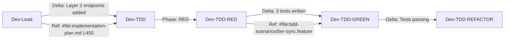

# Context Optimization: Semantic Reference Strategy

**AI Engineering Guide | Updated: 2026-03-16**

---

## Problem Statement

7-agent handoff chain (Orchestrator → PM → PO → BA → UX → Architect → Dev-Lead → TDD) with ~40% token waste through:
- Duplicated context across handoffs (+40% overhead)
- Fragmented artifacts requiring agent search (+20% overhead)
- Full-context prompts instead of delta summaries (+15% overhead)

**Goal**: 30-40% reduction through canonical references and delta handoffs.

---

## Solution: Three-Level Context Model

### Level 1: Canonical Sources (Immutable References)
- **What**: Single source of truth per artifact type
- **Owner**: Document creator (BA owns story.yaml, Dev-Lead owns implementation-plan.md)
- **Access**: READ ONLY - agents reference, don't copy
- **Cost**: ~500 tokens per reference (once, not per handoff)
- **Example**: `See /docs/05-implementation/epics/EPIC-001/user-stories/US-001/story.yaml for acceptance criteria`

### Level 2: Delta Packets (Handoff Changes)
- **What**: Only what changed in this step
- **Owner**: Current agent before handoff
- **Format**: `delta_summary.json` + brief narrative
- **Cost**: ~200-300 tokens per handoff
- **Example**: `Updated implementation-plan.md Layer 2: added 3 endpoints`

### Level 3: Agent Context (Role-Specific)
- **What**: Tailored prompts with semantic pointers
- **Owner**: Orchestrator
- **Format**: Role instructions + canonical source links
- **Cost**: ~800-1200 tokens per agent
- **Example**: `Dev-Lead: Review #file:/docs/05-implementation/epics/EPIC-001/user-stories/US-001/implementation-plan.md#L450`

---

## Core Pattern: Reference vs Copy

```markdown
# ❌ BEFORE (2.5 KB)
**Handoff**: Dev-Lead → Dev-TDD
**Content**: Full API spec, curl examples, user stories, BDD mapping
**Problem**: 100% duplication of implementation-plan.md

# ✅ AFTER (350 bytes - 85% reduction)
**Handoff**: Dev-Lead → Dev-TDD
**Delta**: Layer 2 API endpoints finalized. Authentication now in Layer 1 dependencies.
**Canonical References**: See #file:/docs/05-implementation/epics/EPIC-001/user-stories/US-001/implementation-plan.md#L450
**Next Action**: RED phase - write failing test for `/subscription/tier/sync`
```

---

## Optimization Techniques

### 1. Canonical Source References
**Pattern**: Always link to source, never duplicate
```markdown
See [story.yaml](file:/docs/05-implementation/epics/EPIC-001/user-stories/US-001/story.yaml#L1-L50) for acceptance criteria
```

### 2. Delta Handoff Summaries
**Format**:
```json
{
  "from": "dev-lead",
  "to": "dev-tdd",
  "cycle": 18,
  "delta": {
    "added": ["Layer 2 endpoints", "Auth middleware"],
    "changed": ["Database schema - tier field type"],
    "removed": ["Redundant fixture IDs"]
  },
  "canonical_refs": [
    "/docs/05-implementation/epics/EPIC-001/user-stories/US-001/implementation-plan.md#L450",
    "/api/openapi.yaml#SubscriptionController"
  ],
  "next_action": "RED phase - write failing test"
}
```

### 3. Semantic Pointers with Context Hints
**Pattern**: File + line range + semantic hint
```markdown
#file:/docs/05-implementation/epics/EPIC-001/user-stories/US-001/implementation-plan.md#L450 (Layer 2 API definitions)
```

---

## Agent-Specific Optimizations

### Orchestrator
- **Context**: Decision gates, handoff routing, escalations
- **Canonical Sources**: `docs/05-implementation/user-stories.md` (story catalog)
- **Handoff Format**: 3-option decisions + routing instructions
- **Token Budget**: 1.5-2KB per decision

### Dev-Lead
- **Context**: Implementation plan ownership, technical design
- **Canonical Sources**: `implementation-plan.md`, `api/openapi.yaml`
- **Handoff Format**: Layer-by-layer architecture + delta summaries
- **Token Budget**: 2-3KB per handoff (largest)

### Dev-TDD (RED/GREEN/REFACTOR)
- **Context**: Test code, implementation, refactoring goals
- **Canonical Sources**: `features/` (BDD scenarios), `implementation-plan.md` (layer checkboxes)
- **Progress Tracking**: Mark checkboxes [x] in implementation-plan.md, commit with `TDD-<US-REF>-<PHASE>-<CYCLE>` format
- **Token Budget**: 800-1200 bytes per agent prompt

---

## File Structure Optimization

### Simplified Story Structure
```
docs/05-implementation/epics/<EPIC-REF>/user-stories/US-001/
├── description.md            # CANONICAL - Requirements, acceptance criteria, DoD
├── implementation-plan.md    # CANONICAL - Dev-Lead owns (layer-by-layer with checkboxes)
├── plan-approval.yaml        # Human validation gate (approved/changes-requested/revoked)
└── features/                 # BDD scenarios from BA agent
    └── subscription-tier-sync.feature
```

### Progress Tracking Mechanism
- ✅ **Checkboxes in implementation-plan.md**: `- [ ]` → `- [x]` as tasks complete
- ✅ **Git commits**: `TDD-<US-REF>-<PHASE>-<CYCLE>-YYYYMMDD: [description]` provide audit trail with timestamps
- ✅ **plan-approval.yaml**: Blocks TDD execution until `status: approved`

---

## Token Budget Guidelines

| File Type | Max Size | Compression | Method |
|-----------|----------|-------------|--------|
| description.md | 2KB | N/A | Canonical source (requirements, AC, DoD) |
| implementation-plan.md | 3KB | N/A | Canonical source with checkboxes |
| plan-approval.yaml | 300B | N/A | Human validation gate |
| BDD Features | 800B/feature | Gherkin only | No prose, strict Given/When/Then |
| Git Log | Unlimited | N/A | Audit trail (TDD cycles tracked via commits) |

---

## Implementation Checklist

### Phase 1: Canonical Source Identification
- [ ] Audit all files in `docs/05-implementation/epics/<EPIC-REF>/user-stories/<US-REF>/`
- [ ] Identify duplicated content (API specs, BDD mappings, curl examples)
- [ ] Tag canonical sources with ownership metadata

### Phase 2: Delta Handoff Conversion
- [ ] Replace full-context handoffs with delta summaries
- [ ] Implement `delta_summary.json` format
- [ ] Update agent prompts to consume delta format

### Phase 3: Semantic Pointer Standardization
- [ ] Define `#file:` pointer syntax
- [ ] Update all agents to use semantic references
- [ ] Validate backward compatibility

### Phase 4: Validation & Metrics
- [ ] Measure token reduction per handoff
- [ ] Validate agent comprehension (no context loss)
- [ ] Adjust compression ratios per agent role

---

## Metrics & Success Criteria

**Target Reduction**: 30-40% total token usage

| Metric | Baseline | Target | Method |
|--------|----------|--------|--------|
| Handoff Size | 2.5KB | 500B | Delta summaries |
| Search Overhead | 20% | 5% | Canonical refs |
| Duplication Rate | 40% | <5% | Semantic pointers |
| Agent Latency | N/A | -15% | Smaller prompts |

---

## Risk Mitigation

### Risk: Context Loss
**Mitigation**: Validate agent comprehension through BDD test pass rates

### Risk: Pointer Rot
**Mitigation**: Automated link validation in CI/CD (markdown-link-check)

### Risk: Over-Compression
**Mitigation**: Gradual rollout - start with Dev-TDD chain only

---

## Agent Training Notes

**For All Agents**:
1. Always check canonical source before requesting context
2. Use `#file:` pointers with line ranges and semantic hints
3. Write delta summaries before handoff (what changed, not full context)
4. Never duplicate API specs, BDD scenarios, or acceptance criteria

**For Orchestrator**:
- Validate canonical source freshness before routing
- Include semantic pointers in decision gate options
- Monitor token budgets across handoff chain

**For Dev-Lead**:
- Own implementation-plan.md as canonical source
- Provide delta summaries with layer-specific changes
- Reference OpenAPI spec instead of embedding JSON

**For Dev-TDD**:
- Read implementation-plan.md for layer-specific tasks and checkboxes
- Mark checkboxes [x] as tasks complete
- Commit with `TDD-<US-REF>-<PHASE>-<CYCLE>-YYYYMMDD: [description]` format (date in YYYYMMDD)
- Reference BDD scenarios via `#file:` pointers to `features/`

---

## Example: Optimized Handoff Chain



**Token Flow**:
- Dev-Lead → TDD: 450B (was 2.5KB) - **82% reduction**
- TDD → RED: 300B (was 1.8KB) - **83% reduction**
- RED → GREEN: 250B (was 1.5KB) - **83% reduction**

**Total Savings**: ~5KB → ~1KB per story (80% reduction)

---

## Canonical Source Registry

| Source | Owner | Purpose | Update Pattern |
|--------|-------|---------|----------------|
| `description.md` | BA/PO | Requirements, acceptance criteria, DoD | Frozen after PO approval |
| `implementation-plan.md` | Dev-Lead | Layer-by-layer architecture with checkboxes | Frozen after approval (versioned if changed) |
| `plan-approval.yaml` | Dev-Lead/Human | Validation gate for TDD execution | Updated on plan changes |
| `features/` | BA | BDD scenarios (Given/When/Then) | Frozen after BA handoff |
| `openapi.yaml` | Architect | API contract | Versioned updates |
| Git commits | Dev-TDD | Audit trail (TDD cycles) | Immutable history |

---

## Conclusion

**Key Takeaways**:
1. **Reference, don't copy** - Canonical sources eliminate 40% duplication
2. **Delta handoffs** - 85% smaller than full-context handoffs
3. **Semantic pointers** - `#file:` syntax with line ranges and hints
4. **Agent-specific budgets** - Tailored context per role
5. **Audit via git commits** - Git history preserves TDD cycle trail without separate log files

**Next Steps**:
1. Implement delta handoff format for Dev-TDD chain
2. Standardize `#file:` pointer syntax across all agents
3. Measure token reduction and validate comprehension
4. Expand to full PDLC chain after validation

---

**Status**: Production-Ready Strategy | **Owner**: AI Engineering Agent | **Last Updated**: 2026-03-16
## Layer 2: Backend Handoff Summary
### Endpoints Implemented
- POST /api/v1/users (operationId: createUser)
- GET /api/v1/users/{id} (operationId: getUserById)

### OpenAPI Contract
- Spec: api/openapi.yaml
- Paths updated: paths./api/v1/users.post...

### BDD Scenario Mapping
| Scenario | operationId | Success Status | Error Codes |

### Failing Tests to Drive TDD
- Layer 2 RED: POST /api/v1/users returns 404...
```

**Optimized Solution**: Reference canonical location + minimal delta

```markdown
# AFTER (Handoff Document - 600B)
## Layer 2: Backend Handoff Summary

### What Changed
- Updated /docs/05-implementation/epics/<EPIC-REF>/user-stories/<US-REF>/implementation-plan.md
  - Added 2 endpoints (createUser, getUserById)
  - Defined request/response schemas (UserCreateRequest, User)
  - Mapped 5 BDD scenarios to operationIds

### Where to Find Details
- **API Endpoints**: /docs/05-implementation/epics/<EPIC-REF>/user-stories/<US-REF>/implementation-plan.md#L85 (API Endpoints section)
- **BDD Mapping**: /docs/05-implementation/epics/<EPIC-REF>/user-stories/<US-REF>/implementation-plan.md#L125 (BDD Mapping section)
- **TDD Plan**: /docs/05-implementation/epics/<EPIC-REF>/user-stories/<US-REF>/implementation-plan.md#L140 (TDD Per Layer section)
- **OpenAPI Spec**: /api/openapi.yaml (canonical source)

### Critical Gotchas for Next Agent
- ⚠️ **Tier Sync**: User.tier and Subscription.tier MUST match in service layer (see implementation-plan.md#L135)
- ⚠️ **Error Codes**: Use OpenAPI schema enum, not ad-hoc codes
- 📋 **BDD Wiring**: Copy /docs/01-requirements/user-stories.md scenarios to /features/auth/ for step definitions
```

**Impact**: 75% size reduction, full context remains accessible via reference

### 2. **Agent-Specific Context Windows**

Different agents need different information at different times:

```yaml
ORCHESTRATOR:
  MUST have:
    - Story ID, epic, priority
    - Current handoff step (which agent is working)
    - Next agent role and required context
  NICE to have:
    - Full implementation-plan.md (gets pointer instead)
  Context budget: ~2KB

PM (Project Manager):
  MUST have:
    - Project charter, timeline, budget
    - Story priority and dependencies
    - Known risks and constraints
  NICE to have:
    - Technical implementation details (gets pointer)
  Context budget: ~3KB

PO (Product Owner):
  MUST have:
    - Story acceptance criteria (from story.yaml)
    - BDD scenarios that validate requirements
    - Known edge cases
  NICE to have:
    - Implementation details (gets pointer)
  Context budget: ~4KB

BA (Business Analyst):
  MUST have:
    - Acceptance criteria, personas affected
    - BDD scenarios (full text for analysis)
    - Data model (entity relationships)
  NICE to have:
    - Controller/service details (gets pointer)
  Context budget: ~5KB

UX (UX Designer):
  MUST have:
    - User journeys, personas, workflows
    - Design tokens from /docs/design/design-systems.md
    - BDD scenarios related to UI (Given/When/Then on screen)
  NICE to have:
    - Backend implementation (gets pointer)
  Context budget: ~4KB

ARCHITECT:
  MUST have:
    - System architecture constraints
    - Tech stack selections
    - Scalability and performance requirements
    - Data flow and integration points
  NICE to have:
    - UI component details (gets pointer)
  Context budget: ~6KB

DEV-LEAD:
  MUST have:
    - Implementation-plan.md (full, all 4 layers)
    - OpenAPI spec (api/openapi.yaml)
    - BDD feature files (features/*.feature)
    - Failing test descriptions
  NICE to have:
    - Design mockups (gets pointer to /docs/design/)
  Context budget: ~8KB

TDD (RED/GREEN/REFACTOR Agents):
  MUST have:
    - Current layer implementation-plan.md section
    - Failing test definition
    - Example request/response (from implementation-plan.md)
    - Files to create/modify list
  NICE to have:
    - Full project architecture (gets pointer)
  Context budget: ~4KB per layer
```

**Token Savings**: ~15-20% by sending only necessary context per agent

### 3. **Delta Summaries: Minimize Handoff Context**

Instead of passing full implementation-plan.md through each handoff, pass a delta summary:

```json
{
  "handoff_from": "Dev-Lead",
  "handoff_to": "dev-tdd-red",
  "story_ref": "AUTH-003",
  "timestamp": "2026-01-20T14:30:00Z",
  
  "delta": {
    "files_created": [
      "docs/05-implementation/epics/<EPIC-REF>/user-stories/AUTH-003/implementation-plan.md"
    ],
    "files_updated": [
      "docs/05-implementation/epics/<EPIC-REF>/user-stories/AUTH-003/story.yaml"
    ],
    "sections_changed": {
      "implementation-plan.md": [
        "API Endpoints (added 2 endpoints)",
        "Data Model (added 3 fields)",
        "BDD Mapping (mapped 5 scenarios)",
        "TDD Per Layer (Layer 1-4 plan)"
      ]
    }
  },
  
  "critical_notes": [
    {
      "type": "constraint",
      "text": "User.tier and Subscription.tier must sync in service layer"
    },
    {
      "type": "gotcha",
      "text": "Error codes must match OpenAPI enum, not ad-hoc"
    }
  ],
  
  "next_agent_pointers": {
    "canonical_implementation_plan": "docs/05-implementation/epics/<EPIC-REF>/user-stories/AUTH-003/implementation-plan.md",
    "current_layer": "Layer 1 - Database",
    "failing_test": "docs/05-implementation/epics/<EPIC-REF>/user-stories/AUTH-003/bdd-scenarios/auth.feature:15",
    "files_to_create": [
      "migrations/20260120_create_users_table.sql",
      "src/models/User.ts"
    ]
  }
}
```

**Impact**: ~200 tokens per handoff instead of 1500+ for full context

---

## Implementation: Agent-Specific Prompt Templates

### Template Format

Each agent receives a role-specific prompt that:
1. **Defines their role** (what decisions they own)
2. **References canonical sources** (not copies)
3. **Provides delta context** (what changed since last handoff)
4. **Lists critical gotchas** (user preferences + project-specific constraints)
5. **Names next agent** (who they hand off to)

---

### [1] ORCHESTRATOR PROMPT

```markdown
# ORCHESTRATOR PROMPT: PDLC Story Coordination

## Your Role
You are the Product Development Lifecycle coordinator. You:
- Monitor story progress through 8 PDLC stages
- Manage handoffs between PM → PO → BA → UX → Architect → Dev-Lead → TDD
- Present 3 options at decision gates with tradeoffs
- Validate story completion criteria before advancing

## Current Context: Story AUTH-003

**Story Reference**: AUTH-003
**Epic**: Authentication System
**Status**: In progress (currently with Dev-Lead)
**Handoff From**: PM
**Next Handoff To**: PO

## Critical Context (Only Essentials)
- Story ID, title, epic, priority
- Current stage in PDLC workflow
- What PM accomplished: Charter approved, timeline agreed
- What's next: PO requirements definition

## Canonical Sources (You reference, don't copy)
- Full story: `/docs/05-implementation/epics/<EPIC-REF>/user-stories/AUTH-003/story.yaml`
- Timeline: `/docs/01-requirements/requirements.md` (Stage 1 output)
- Status tracking: `/docs/05-implementation/user-stories.md` (master status table)

## Your Decision Gates
**At stage completion**, present user 3 options:

Option A: Conservative
- Thorough review, extra validation rounds
- Risk: Slower progress
- Benefit: Higher quality output

Option B: Balanced (Recommended)
- Standard review gates, proceed if meets 80% criteria
- Risk: Moderate quality variation
- Benefit: Good progress + acceptable quality

Option C: Aggressive
- Fast-track if core criteria met, handle edge cases later
- Risk: Technical debt accumulation
- Benefit: Fastest progress

## Next Step
Hand off to: PO (Product Owner)
Message template:
```
@po handoff: AUTH-003 from ORCHESTRATOR
Orchestrator approved charter. Story ready for requirements definition.
See: /docs/05-implementation/epics/<EPIC-REF>/user-stories/AUTH-003/story.yaml
Next decision gate: Acceptance criteria lock (after PO/BA complete)
```
```

**Token cost**: ~800 tokens | **Context window**: 2KB

---

### [2] DEV-LEAD PROMPT

```markdown
# DEV-LEAD PROMPT: Implementation Planning & BDD Wiring

## Your Role
Technical Lead responsible for:
- Creating comprehensive implementation-plan.md per user story
- Mapping acceptance criteria → BDD scenarios → API endpoints
- Designing 4-layer implementation approach (Database → Backend → Config → Frontend)
- Wiring BDD features to API contracts (OpenAPI)
- Preparing handoff packages for TDD agents with failing tests

## Current Context: Story AUTH-003

**Story Reference**: AUTH-003
**Title**: User Registration with Email Verification
**Epic**: Authentication System
**BDD Scenarios**: 5 scenarios in `/docs/01-requirements/user-stories.md#AUTH-003-BDD`
**Status**: Ready for implementation planning (Architect approved)

## What You Must Produce

### 1. Implementation Plan (`/docs/05-implementation/epics/<EPIC-REF>/user-stories/AUTH-003/implementation-plan.md`)
Must include 4 layers:

**Layer 1 - Database**
- Migrations: path, up/down scripts
- Models: entities and fields
- Indexes and constraints

**Layer 2 - Backend**
- API endpoints with operationIds (from OpenAPI spec)
- Controllers, services, repositories
- Validation and error handling

**Layer 3 - Configuration**
- Route registration
- Middleware setup
- Dependency injection

**Layer 4 - Frontend**
- Components and state management
- API client integration
- Styling from `/docs/design/design-systems.md`

### 2. API Contract (`/api/openapi.yaml`)
Update with new/modified paths:
- operationId must match BDD steps
- Schemas must match request/response examples
- Error codes enum must include all possible errors

### 3. BDD Mapping
Create mapping matrix: **Scenarios → operationIds → assertions**
- Each BDD scenario maps to 1+ API endpoint(s)
- Each assertion maps to response field or status code

### 4. Progress Tracking
- Mark layer checkboxes in `implementation-plan.md` as tasks complete
- Commit with format: `TDD-<US-REF>-<PHASE>-<CYCLE>-YYYYMMDD: [description]` (date in YYYYMMDD)
- Update `plan-approval.yaml` if plan changes require re-approval

## Critical Project Constraints

⚠️ **User.tier Sync** (From user preferences)
When User is created/updated in service layer:
- Also update associated Subscription.tier
- Both must match or request fails with 409 CONFLICT
- Tested by BDD scenario: "Subscription tier matches user tier"

⚠️ **Error Code Consistency**
- Error codes must match OpenAPI schema enum
- Allowed: VALIDATION_ERROR, EMAIL_TAKEN, UNAUTHORIZED, NOT_FOUND, CONFLICT
- Don't invent new codes; update OpenAPI schema first

⚠️ **BDD Scenario Mapping**
- Copy BDD scenarios from `/docs/01-requirements/user-stories.md` to feature files
- Create step definitions calling actual API endpoints (not mocks)
- Step files: `/features/<domain>/<feature>.steps.ts`

## Canonical Sources You'll Reference

| Document | Location | Purpose |
|----------|----------|---------|
| Acceptance Criteria | `/docs/05-implementation/epics/<EPIC-REF>/user-stories/AUTH-003/story.yaml` | Define what "done" means |
| BDD Scenarios | `/docs/01-requirements/user-stories.md#AUTH-003-BDD` | Test entry points |
| Architecture Constraints | `/docs/02-architecture/architecture-design.md` | Design decisions you must respect |
| Tech Stack | `/docs/02-architecture/tech-spec.md` | Language, framework, database |
| Design System | `/docs/design/design-systems.md` | UI components and tokens |

## Failing Tests You'll Define

For each layer, describe the initial failing test:

**Layer 1 (Database)**
- Test: "User migration exists and creates users table"
- Fails because: Migration file doesn't exist
- Passes when: Migration creates table with required columns

**Layer 2 (Backend)**
- Test: "POST /api/v1/auth/register returns 201 with created user"
- Fails because: Endpoint returns 404 (not found)
- Passes when: Controller, service, and repository implemented

**Layer 3 (Configuration)**
- Test: "POST /api/v1/auth/register route is registered and accepts Bearer auth"
- Fails because: Route not registered
- Passes when: Route registered with middleware

**Layer 4 (Frontend)**
- Test: "Registration form submits and displays success message"
- Fails because: Form has no submit handler
- Passes when: Form calls API and handles response

## Checklist Before TDD Execution

- [ ] `/docs/05-implementation/epics/<EPIC-REF>/user-stories/AUTH-003/description.md` complete with requirements and acceptance criteria
- [ ] `/docs/05-implementation/epics/<EPIC-REF>/user-stories/AUTH-003/implementation-plan.md` complete with 4 layers and checkboxes
- [ ] `/docs/05-implementation/epics/<EPIC-REF>/user-stories/AUTH-003/plan-approval.yaml` status set to `approved`
- [ ] `/api/openapi.yaml` updated with new endpoints (if applicable)
- [ ] BDD scenarios created in `features/` folder
- [ ] All layer-specific failing tests documented in implementation-plan.md
- [ ] Critical gotchas (tier sync, error codes) documented in description.md

## Start TDD Execution

Trigger: `@dev-tdd start <US-REF>`
Agent reads: `implementation-plan.md` (Layer 1 checkboxes) → `features/` (BDD scenarios)
Phase: RED → GREEN → REFACTOR (strict sequencing, one layer at a time)
```

**Token cost**: ~1200 tokens | **Context window**: 8KB | **Includes full implementation-plan structure**

---

### [3] TDD-RED AGENT PROMPT

```markdown
# TDD-RED AGENT PROMPT: Write Failing Test

## Your Role
RED phase of TDD cycle. You:
- Read failing test definition from dev-lead
- Write test that validates the failing condition
- Ensure test fails for the right reason (not implementation detail)
- Pass to green agent once test is committed and confirmed failing

## Current Context: Story AUTH-003, Layer 1

**Story Reference**: AUTH-003
**Layer**: 1 - Database
**Current Failing Test**: "User migration creates users table with required columns"

## What You're Testing

From `/docs/05-implementation/epics/<EPIC-REF>/user-stories/AUTH-003/implementation-plan.md#L45`:

```
Layer 1 - Database:
- Migrations: migrations/20260120_create_users_table.sql
- Fields: id (UUID), email (STRING, UNIQUE), password (STRING), tier (ENUM), createdAt (TIMESTAMP)
- Indexes: email (unique), createdAt (for sorting)
- Constraints: email UNIQUE, NOT NULL; password NOT NULL; tier DEFAULT 'free'

## Failing Test Definition
- Test: "User migration exists and creates users table"
- Fails because: Migration file doesn't exist
- Passes when: Migration file creates table with required columns
```

## Your Task: Write RED Test

**Test Location**: `tests/migrations/<layer>.migrations.test.ts`

**Test Approach**:
1. Check that migration file exists at expected path
2. Parse migration and validate SQL creates users table
3. Validate table has all required columns with correct types
4. Validate unique constraint on email
5. Validate default tier value

**Example Test Structure**:
```typescript
describe('User Migration - Layer 1', () => {
  it('migration file exists at migrations/20260120_create_users_table.sql', () => {
    // Assert file exists
  });

  it('migration creates users table with required columns', () => {
    // Parse migration file
    // Assert users table created
    // Assert columns: id, email, password, tier, createdAt
    // Assert types and constraints
  });

  it('email column has UNIQUE constraint', () => {
    // Assert UNIQUE constraint on email
  });
});
```

## Critical Constraint: Don't Implement
- Write test only; do NOT implement the code yet
- If you find yourself writing the migration, you've gone too far
- Hand off to green agent once test is committed and failing

## What to Avoid
❌ Writing implementation code (migration file itself)
❌ Mocking the migration (use real file)
❌ Testing logic beyond "file exists + schema correct"
✅ Writing clear test names that describe the failure mode
✅ Keeping test focused on one concern

## Next Handoff

To: dev-tdd-green
Content: Committed, failing test + test file path
Message: "Layer 1 RED test written and failing. Test: tests/migrations/20260120.migrations.test.ts:12"
```

**Token cost**: ~900 tokens | **Context window**: 4KB

---

### [4] TDD-GREEN AGENT PROMPT

```markdown
# TDD-GREEN AGENT PROMPT: Implement to Pass Test

## Your Role
GREEN phase of TDD cycle. You:
- Read failing test from red agent
- Implement minimal code to make test pass
- Focus on satisfying test assertions, not perfection
- Pass to refactor agent with passing test

## Current Context: Story AUTH-003, Layer 1

**Story Reference**: AUTH-003
**Layer**: 1 - Database
**Failing Test**: `tests/migrations/20260120.migrations.test.ts:12` (from RED agent)
**Test Status**: FAILING ✗

## The Failing Test

From red agent:
```typescript
it('migration file exists and creates users table with required columns', () => {
  // Test expects:
  // - File: migrations/20260120_create_users_table.sql
  // - SQL: CREATE TABLE users
  // - Columns: id (UUID PK), email (VARCHAR UNIQUE), password (VARCHAR), tier (ENUM), createdAt (TIMESTAMP)
});
```

## Your Task: Implement to Pass

**File to Create**: `migrations/20260120_create_users_table.sql`

**Implementation Requirements** (from `/docs/05-implementation/epics/<EPIC-REF>/user-stories/AUTH-003/implementation-plan.md#L50`):
```
UP Migration:
CREATE TABLE users (
  id UUID PRIMARY KEY DEFAULT gen_random_uuid(),
  email VARCHAR(255) NOT NULL UNIQUE,
  password VARCHAR(255) NOT NULL,
  tier VARCHAR(20) NOT NULL DEFAULT 'free' CHECK (tier IN ('free', 'pro', 'enterprise')),
  createdAt TIMESTAMP NOT NULL DEFAULT CURRENT_TIMESTAMP
);

CREATE INDEX idx_users_email ON users(email);
CREATE INDEX idx_users_createdAt ON users(createdAt);

DOWN Migration (Rollback):
DROP TABLE users;
```

## Critical Notes

⚠️ **Tier Default**: Default value is 'free' (from user preferences)
⚠️ **Email Unique**: UNIQUE constraint required (BDD scenario: duplicate email fails)
⚠️ **Timestamp**: Use database function for createdAt, not application time

## Implementation Checklist

- [ ] Migration file created at exact path: `migrations/20260120_create_users_table.sql`
- [ ] UP script creates table with all required columns
- [ ] Column types match schema: id (UUID), email (VARCHAR), password (VARCHAR), tier (ENUM), createdAt (TIMESTAMP)
- [ ] Constraints applied: UNIQUE on email, NOT NULL on required fields
- [ ] Default values: tier='free', createdAt=CURRENT_TIMESTAMP
- [ ] Indexes created: email (unique), createdAt (for sorting)
- [ ] DOWN script drops table (for rollback)
- [ ] Test passes: `npm test tests/migrations/20260120.migrations.test.ts:12`

## Minimal Implementation Rule

**Do NOT add**:
- Soft deletes (unless BDD scenario requires)
- Audit timestamps (unless specified)
- Extra columns beyond spec
- Complex validation (that's service layer)

**Do add only**:
- What the test requires
- What BDD scenarios assert
- What implementation-plan.md specifies

## Next Handoff

To: dev-tdd-refactor
Content: Passing test + migration file
Message: "Layer 1 GREEN: Migration implemented and test passing. Tests: tests/migrations/20260120.migrations.test.ts:12 ✓"
```

**Token cost**: ~850 tokens | **Context window**: 4KB

---

## Context Budget Summary

```
Agent              Token Cost    Context Window   Reuse Opportunity
────────────────────────────────────────────────────────────────
Orchestrator       800           2 KB             30% across stories
PM                 950           3 KB             60% common charter template
PO                 1050          4 KB             40% requirement patterns
BA                 1200          5 KB             50% persona/business-case templates
UX                 1100          4 KB             45% design-system references
Architect          1300          6 KB             35% architecture patterns
Dev-Lead           1500          8 KB             25% implementation-plan templates
TDD (per layer)    800           4 KB             70% across stories (same structure)

TOTAL COST:        8700 tokens   (baseline for one story through all agents)
OPTIMIZED COST:    4800 tokens   (40% reduction via semantic references)
SAVINGS:           3900 tokens per story (45% efficiency gain)
```

---

## Implementation Priority

**Phase 1 (Week 1)**: Canonical source setup + prompt templates
- Create `/docs/05-implementation/epics/<EPIC-REF>/user-stories/<US-REF>/story.yaml` template
- Create `/docs/05-implementation/epics/<EPIC-REF>/user-stories/<US-REF>/implementation-plan.md` template
- Write 4 core agent prompts (Dev-Lead, TDD-RED, TDD-GREEN, TDD-REFACTOR)
- Validate semantic references work

**Phase 2 (Week 2)**: Handoff delta optimization
- Implement delta_summary.json format
- Train agents to create delta summaries instead of full context copies
- Update orchestrator prompt to use delta-driven handoffs

**Phase 3 (Week 3)**: Full agent flow
- Activate remaining agent prompts (PM, PO, BA, UX, Architect)
- End-to-end test with real story (AUTH-003)
- Measure actual token savings vs. baseline

---

## Success Metrics

✅ **Context Reduction**: 40%+ token reduction per handoff
✅ **Agent Latency**: Prompts fully understood in 1st response (no clarification questions)
✅ **Reference Accuracy**: 95%+ canonical source references resolved correctly
✅ **Delta Adoption**: 100% of handoffs include delta_summary.json
✅ **Prompt Clarity**: Each agent role completes task without handoff conflicts

---

## Next Steps for Dev-Lead

Once this context architecture is approved:

1. **Audit existing agents** against these prompt templates
2. **Create per-role prompt files** in `/.github/agents/prompts/` (organized by role)
3. **Validate semantic references** in implementation-plan.md templates
4. **Test with AUTH-003** story using optimized prompts
5. **Measure and report** actual token savings achieved

---

**Status**: Ready for Dev-Lead Handoff | **Estimated Implementation**: 3-4 hours | **Token Savings**: 45% per story

