# Diagram Usage Guide

**Version**: 1.0.0  
**Last Updated**: December 2025  
**Purpose**: Guide for choosing and creating effective diagrams in technical documentation

---

## Table of Contents

1. [Overview](#overview)
2. [Setup & Configuration](#setup--configuration)
3. [Mermaid vs PlantUML Decision Matrix](#mermaid-vs-plantuml-decision-matrix)
4. [Mermaid Diagram Types](#mermaid-diagram-types)
5. [PlantUML Diagram Types](#plantuml-diagram-types)
6. [Diagram Best Practices](#diagram-best-practices)
7. [Examples](#examples)
8. [Troubleshooting](#troubleshooting)

---

## Overview

Effective diagrams are essential for communicating complex technical concepts. This guide helps you choose the right diagramming tool and create clear, maintainable diagrams.

### Why Two Tools?

- **Mermaid**: Simpler syntax, better for high-level flows, built-in GitHub/GitLab rendering
- **PlantUML**: More powerful UML support, better for detailed class diagrams and implementation details

---

## Setup & Configuration

### Mermaid Setup (VS Code)

Mermaid works out-of-the-box with most markdown preview extensions. No additional setup required.

**Recommended VS Code Extensions:**
- **Markdown Preview Enhanced** (shd101wyy.markdown-preview-enhanced)
- **Markdown Preview Mermaid Support** (bierner.markdown-mermaid)

Install via command palette (`Cmd+Shift+P` on Mac, `Ctrl+Shift+P` on Windows/Linux):
```
ext install shd101wyy.markdown-preview-enhanced
```

### PlantUML Setup (VS Code)

PlantUML requires additional configuration. Choose one of the following options:

#### Option 1: Use Online PlantUML Server (Recommended - Easiest)

**Advantages:**
- No local installation required
- Works immediately
- No Java dependency
- Always up-to-date

**Setup Steps:**

1. Install **Markdown Preview Enhanced** extension (if not already installed)
2. Open VS Code Settings (`Cmd+,` on Mac, `Ctrl+,` on Windows/Linux)
3. Search for: `markdown-preview-enhanced.plantumlServer`
4. Set the value to: `https://kroki.io/plantuml/svg/`

**Alternative Online Servers:**
- Official PlantUML: `https://www.plantuml.com/plantuml/svg/`
- Kroki (recommended): `https://kroki.io/plantuml/svg/`

**Via settings.json:**
```json
{
  "markdown-preview-enhanced.plantumlServer": "https://kroki.io/plantuml/svg/"
}
```

#### Option 2: Use Local plantuml.jar (For Offline Work)

**Advantages:**
- Works offline
- Faster rendering (no network latency)
- Private diagrams stay local

**Requirements:**
- Java Runtime Environment (JRE) 8 or higher

**Setup Steps:**

1. **Install Java (if not already installed):**
   
   **macOS:**
   ```bash
   brew install openjdk
   ```
   
   **Ubuntu/Debian:**
   ```bash
   sudo apt update
   sudo apt install default-jre
   ```
   
   **Windows:**
   Download from [java.com](https://www.java.com/download/)

2. **Verify Java Installation:**
   ```bash
   java -version
   ```
   Should show Java version 8 or higher.

3. **Download plantuml.jar:**
   ```bash
   # Create a directory for PlantUML
   mkdir -p ~/tools/plantuml
   cd ~/tools/plantuml
   
   # Download latest PlantUML jar
   curl -L -o plantuml.jar https://github.com/plantuml/plantuml/releases/download/v1.2024.8/plantuml-1.2024.8.jar
   ```
   
   Or download manually from: [PlantUML Download](https://plantuml.com/download)

4. **Configure VS Code:**
   
   Open VS Code Settings and search for: `markdown-preview-enhanced.plantumlJarPath`
   
   Set the absolute path to your plantuml.jar file:
   - macOS/Linux: `/Users/yourusername/tools/plantuml/plantuml.jar`
   - Windows: `C:\tools\plantuml\plantuml.jar`
   
   **Via settings.json:**
   ```json
   {
     "markdown-preview-enhanced.plantumlJarPath": "/Users/yourusername/tools/plantuml/plantuml.jar"
   }
   ```

5. **Test PlantUML:**
   Create a test markdown file with:
   ````markdown
   ```plantuml
   @startuml
   Alice -> Bob: Hello
   @enduml
   ```
   ````
   
   Open markdown preview (`Cmd+Shift+V` or `Ctrl+Shift+V`) - you should see the diagram.

#### Option 3: PlantUML VS Code Extension (Alternative)

Install the dedicated PlantUML extension:

```
ext install jebbs.plantuml
```

**Features:**
- Syntax highlighting
- Auto-completion
- Export to various formats (PNG, SVG, PDF)
- Preview in separate panel

**Configuration:**
Same as Option 2 - requires either plantuml.jar or online server configuration.

### Verification

After setup, test both diagram types:

**Test Mermaid:**
````markdown
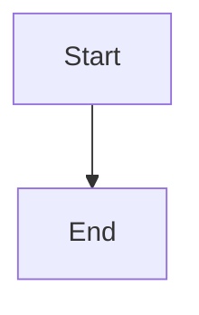
````

**Test PlantUML:**
````markdown
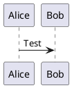
````

Both should render in the markdown preview.

---

## Mermaid vs PlantUML Decision Matrix

| Diagram Type | Complexity | Audience | Recommended Tool | Reason |
|--------------|-----------|----------|------------------|---------|
| **Class Diagram** | Simple (< 5 classes) | All | Mermaid | Easier to read, simpler syntax |
| **Class Diagram** | Complex (> 5 classes, multiple relationships) | Developers | PlantUML | Better UML notation, clearer relationships |
| **Sequence Diagram** | Simple interactions | All | Mermaid | Cleaner, easier to follow |
| **Sequence Diagram** | Complex with loops/conditions | Developers | PlantUML | Better control structures support |
| **Flowchart** | Any | All | Mermaid | More intuitive syntax |
| **State Diagram** | Simple states | All | Mermaid | Clear and simple |
| **State Diagram** | Complex with substates | Developers | PlantUML | Better hierarchical state support |
| **ER Diagram** | Any | All | Mermaid | Built-in ER diagram support |
| **Component Diagram** | Any | Architects/Developers | PlantUML | Standard UML component diagrams |
| **Deployment Diagram** | Any | DevOps/Architects | PlantUML | Infrastructure visualization |
| **Activity Diagram** | Any | All | PlantUML | Better activity flow notation |
| **User Journey** | Any | All | Mermaid | Designed for user flows |
| **Gantt Chart** | Any | Project Managers | Mermaid | Built-in timeline support |

---

## Mermaid Diagram Types

### 1. Flowchart
**Use for**: Process flows, decision trees, algorithm logic

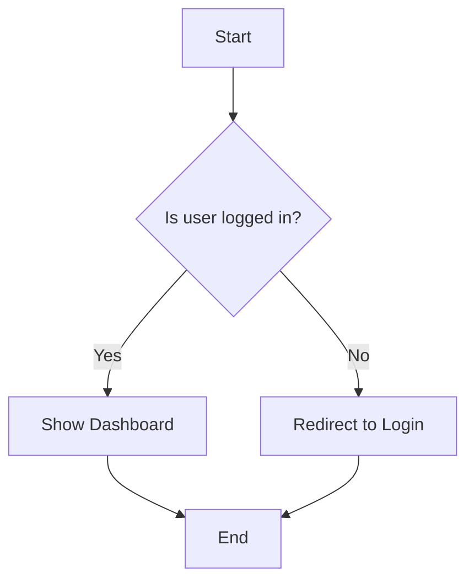

### 2. Class Diagram (Simple)
**Use for**: Simple domain models, basic object relationships

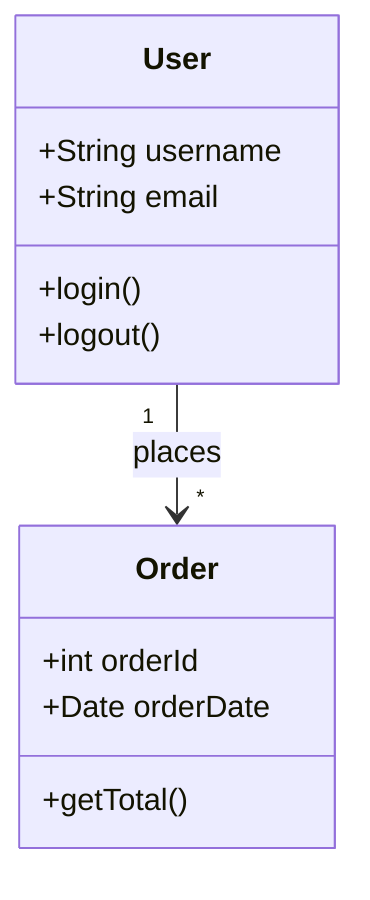

### 3. Sequence Diagram (Simple)
**Use for**: API interactions, simple request-response flows

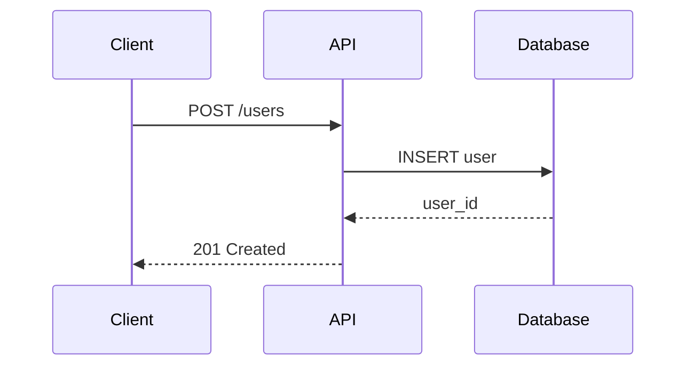

### 4. ER Diagram
**Use for**: Database schema, data relationships

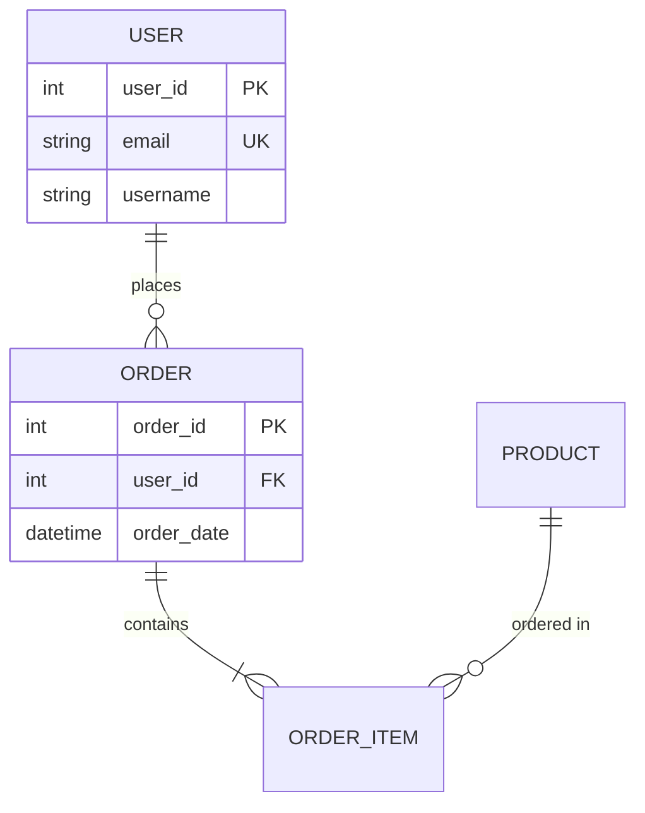

### 5. State Diagram
**Use for**: Object lifecycle, workflow states

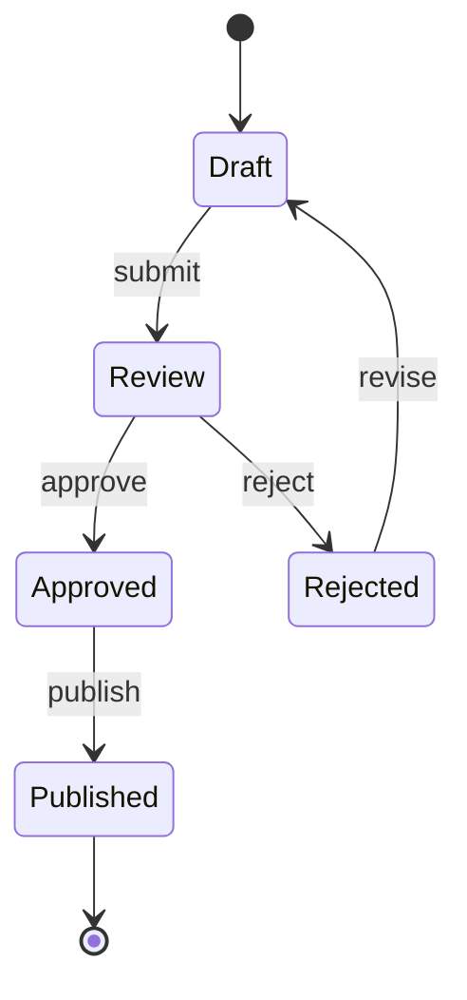

### 6. User Journey
**Use for**: User experience flows, customer journeys

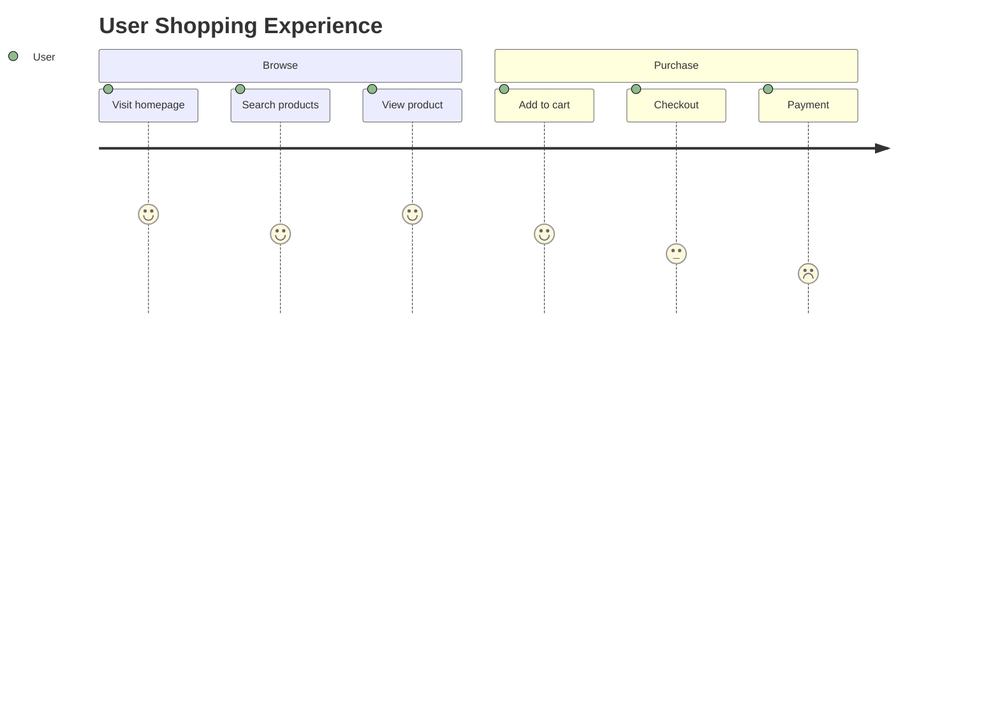

---

## PlantUML Diagram Types

### 1. Class Diagram (Complex)
**Use for**: Detailed OOP design, implementation documentation

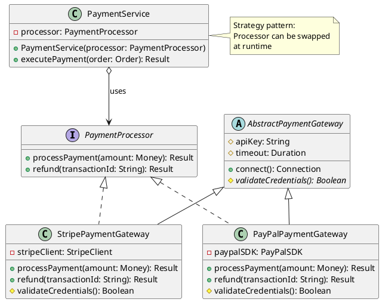

### 2. Sequence Diagram (Complex)
**Use for**: Detailed interaction flows with error handling

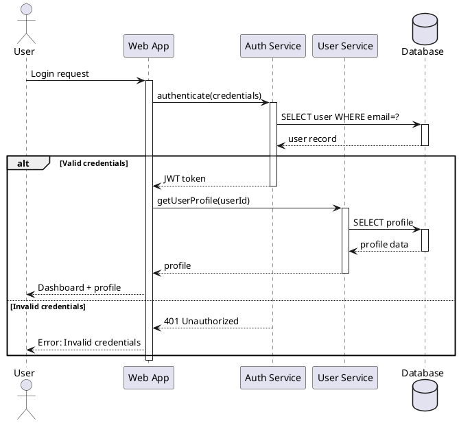

### 3. Component Diagram
**Use for**: System architecture, microservices, module dependencies

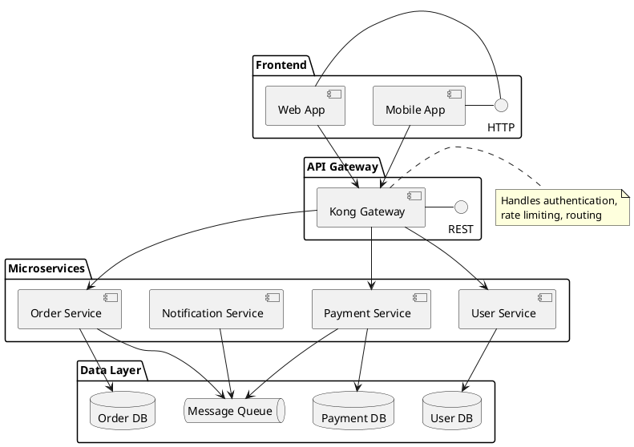

### 4. Deployment Diagram
**Use for**: Infrastructure, server topology, deployment architecture

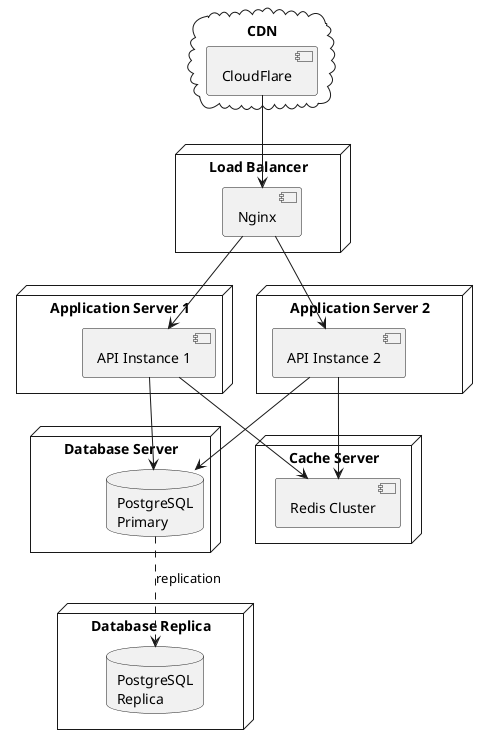

### 5. State Diagram (Complex)
**Use for**: Complex state machines with substates

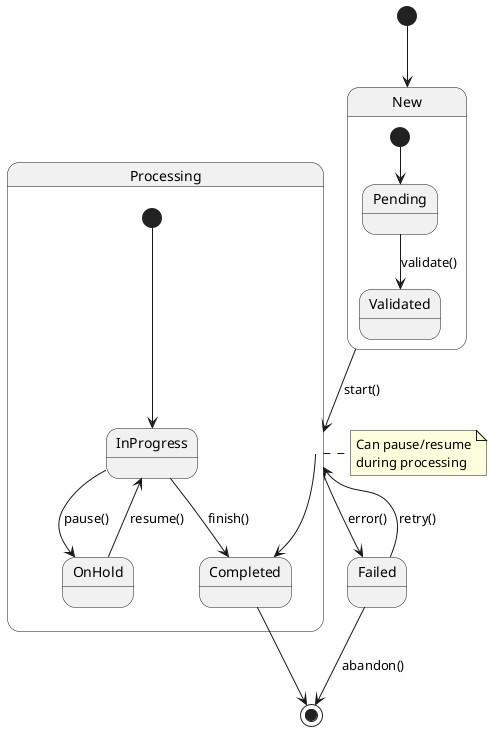

### 6. Activity Diagram
**Use for**: Business process flows, algorithm workflows

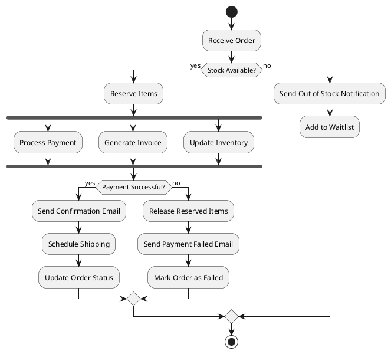

---

## Diagram Best Practices

### 1. General Guidelines

✅ **DO:**
- Keep diagrams focused on one concept
- Use consistent naming conventions
- Add legends for complex diagrams
- Include diagram source code in markdown
- Reference diagrams in surrounding text
- Use colors sparingly and meaningfully
- Label all relationships and flows

❌ **DON'T:**
- Create overly complex diagrams (split into multiple if needed)
- Use too many colors (reduces clarity)
- Mix diagram types without clear purpose
- Leave unlabeled connections or elements
- Create diagrams without explanatory text

### 2. Naming Conventions

**Classes/Components**: PascalCase
- `UserService`, `PaymentProcessor`, `OrderRepository`

**Methods/Functions**: camelCase
- `processPayment()`, `getUserById()`, `calculateTotal()`

**Variables/Parameters**: camelCase
- `userId`, `orderTotal`, `customerEmail`

**Database Tables**: snake_case or PascalCase (be consistent)
- `user_orders` or `UserOrders`

### 3. Relationship Labels

Always label relationships clearly:

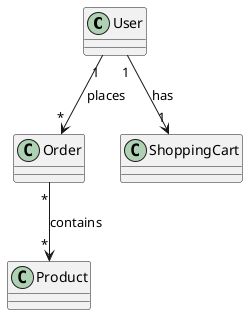

### 4. Documentation Context

Always surround diagrams with context:

```markdown
## User Authentication Flow

The following sequence diagram illustrates the authentication process 
when a user attempts to log in to the system. The flow includes 
credential validation, token generation, and profile retrieval.

[DIAGRAM HERE]

Key points in this flow:
1. Credentials are validated against the database
2. On success, a JWT token is generated
3. User profile is fetched and returned with the token
4. On failure, appropriate error messages are returned
```

### 5. Complexity Management

**If a diagram becomes too complex:**
1. Split into multiple focused diagrams
2. Use hierarchical diagrams (overview → detailed views)
3. Create separate diagrams for different concerns
4. Use notes to explain complex parts

**Example Structure:**
```
1. System Overview Diagram (high-level components)
   ↓
2. Component Interaction Diagram (how they communicate)
   ↓
3. Detailed Sequence Diagrams (specific flows)
```

### 6. Version Control

Include diagram source in markdown files:

```markdown
## Architecture Overview

<!-- Diagram source for editing -->
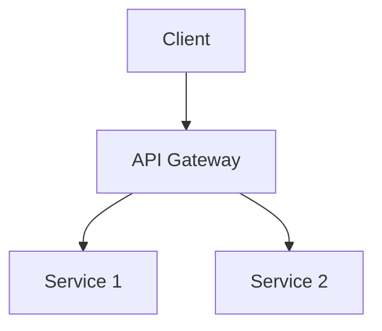

This ensures:
- Diagrams can be updated easily
- Changes are tracked in version control
- No external tool dependencies
```

---

## Examples

### Example 1: Simple Feature Documentation (Use Mermaid)

```markdown
## User Registration Flow

The user registration process follows these steps:

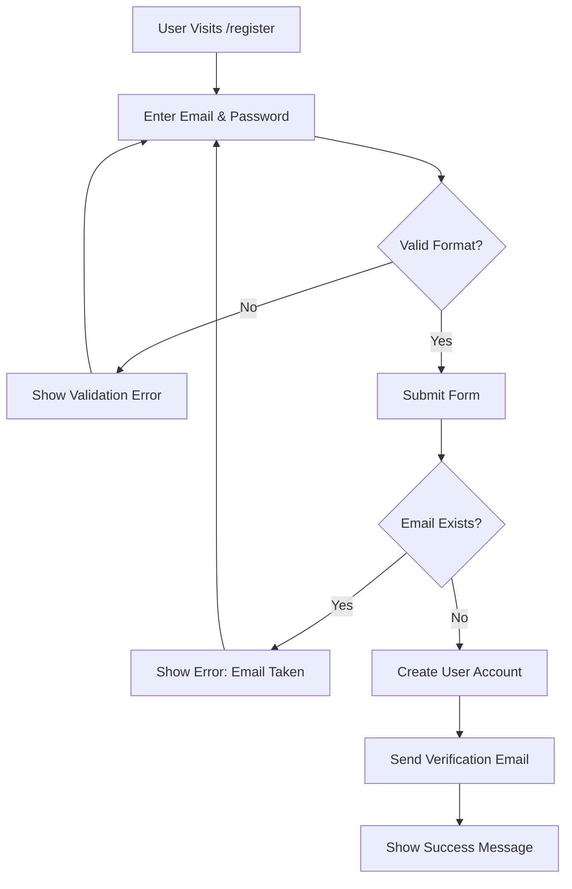

The user must verify their email before accessing the platform.
```

### Example 2: Complex Class Design (Use PlantUML)

```markdown
## Payment Processing Architecture

The payment system follows the Strategy pattern, allowing different 
payment processors to be used interchangeably:

---

## Troubleshooting

### PlantUML Issues

#### Error: "plantuml.jar file not found"

**Solution 1: Use Online Server (Quickest)**
1. Open VS Code Settings (`Cmd+,` or `Ctrl+,`)
2. Search: `markdown-preview-enhanced.plantumlServer`
3. Set to: `https://kroki.io/plantuml/svg/`
4. Reload VS Code window (`Cmd+Shift+P` → "Reload Window")

**Solution 2: Fix Local Path**
1. Verify plantuml.jar exists at the configured path
2. Use absolute path (not relative)
3. Check path in settings: `markdown-preview-enhanced.plantumlJarPath`
4. Ensure no typos in file path

#### Error: "Java not found" or "JAVA_HOME not set"

**macOS/Linux:**
```bash
# Check Java installation
java -version

# If not installed
brew install openjdk  # macOS
sudo apt install default-jre  # Ubuntu/Debian

# Set JAVA_HOME (add to ~/.zshrc or ~/.bashrc)
export JAVA_HOME=$(/usr/libexec/java_home)  # macOS
export JAVA_HOME=/usr/lib/jvm/default-java  # Linux
```

**Windows:**
1. Download Java from [java.com](https://www.java.com/download/)
2. Install and restart terminal
3. Verify: `java -version`

#### Diagrams Not Rendering in Preview

**Checklist:**
- [ ] Markdown Preview Enhanced extension installed
- [ ] Either plantumlServer OR plantumlJarPath configured (not both)
- [ ] VS Code window reloaded after configuration
- [ ] Correct code fence syntax (```plantuml, not ```uml)
- [ ] Diagram starts with `@startuml` and ends with `@enduml`

**Test Configuration:**
```bash
# Test if online server is accessible
curl https://kroki.io/plantuml/svg/

# Test if jar file works
java -jar ~/tools/plantuml/plantuml.jar -version
```

#### Slow Rendering (Online Server)

**Solutions:**
1. Switch to local plantuml.jar (faster for many diagrams)
2. Use a closer online server
3. Reduce diagram complexity
4. Cache diagrams locally after first render

#### Syntax Errors in Diagrams

**Common Issues:**
- Missing `@startuml` or `@enduml`
- Invalid UML syntax (check [PlantUML documentation](https://plantuml.com/))
- Unclosed strings or brackets
- Typos in relationship operators (`-->`, `->`, etc.)

**Debugging:**
1. Copy diagram to [PlantUML Online Editor](http://www.plantuml.com/plantuml/)
2. Check error messages
3. Simplify diagram to isolate issue
4. Verify syntax against examples

### Mermaid Issues

#### Diagrams Not Rendering

**Solutions:**
1. Verify Markdown Preview Enhanced installed
2. Check syntax at [Mermaid Live Editor](https://mermaid.live/)
3. Ensure correct code fence: ```mermaid
4. Reload VS Code window

#### Syntax Errors

**Common Issues:**
- Missing semicolons in older syntax
- Invalid node IDs (use quotes for spaces: `A["Node with spaces"]`)
- Wrong relationship operators
- Missing direction declaration (TD, LR, etc.) in flowcharts

**Debugging:**
1. Copy to [Mermaid Live Editor](https://mermaid.live/)
2. Check error console in browser dev tools
3. Simplify diagram step-by-step
4. Verify syntax against [Mermaid docs](https://mermaid.js.org/)

### GitHub/GitLab Rendering

Both platforms support Mermaid natively but have different PlantUML support:

**GitHub:**
- ✅ Mermaid: Renders automatically
- ❌ PlantUML: Not supported directly (use external service or images)

**GitLab:**
- ✅ Mermaid: Renders automatically  
- ✅ PlantUML: Renders automatically

**For GitHub PlantUML Support:**
Use Kroki.io proxy service:
```markdown

```

Generate URLs at: [Kroki Playground](https://kroki.io/)

### Performance Issues

**For Large Diagrams:**
1. Split into multiple focused diagrams
2. Use local rendering (plantuml.jar) instead of online
3. Reduce number of elements
4. Simplify relationships
5. Consider creating overview + detail diagrams

**Optimization Tips:**
- Limit class diagrams to 10-15 classes max
- Use packages/namespaces to group elements
- Avoid deeply nested structures
- Use notes sparingly

---

## Quick Setup Commands

### For macOS Users (Recommended: Online Server)

```bash
# Open VS Code settings.json
code ~/Library/Application\ Support/Code/User/settings.json

# Add this line:
# "markdown-preview-enhanced.plantumlServer": "https://kroki.io/plantuml/svg/"

# Reload VS Code
# Cmd+Shift+P → "Developer: Reload Window"
```

### For macOS Users (Local JAR Alternative)

```bash
# Install Java
brew install openjdk

# Download PlantUML
mkdir -p ~/tools/plantuml
curl -L -o ~/tools/plantuml/plantuml.jar \
  https://github.com/plantuml/plantuml/releases/download/v1.2024.8/plantuml-1.2024.8.jar

# Add to VS Code settings.json:
# "markdown-preview-enhanced.plantumlJarPath": "/Users/$(whoami)/tools/plantuml/plantuml.jar"

# Test
java -jar ~/tools/plantuml/plantuml.jar -version
```

### For Linux Users

```bash
# Install Java
sudo apt update && sudo apt install default-jre

# Download PlantUML
mkdir -p ~/tools/plantuml
cd ~/tools/plantuml
wget https://github.com/plantuml/plantuml/releases/download/v1.2024.8/plantuml-1.2024.8.jar -O plantuml.jar

# Configure VS Code (online server - easiest)
# Add to settings.json:
# "markdown-preview-enhanced.plantumlServer": "https://kroki.io/plantuml/svg/"
```

### For Windows Users

```powershell
# Install Java from java.com, then:

# Create directory
New-Item -Path "C:\tools\plantuml" -ItemType Directory -Force

# Download PlantUML (PowerShell)
Invoke-WebRequest -Uri "https://github.com/plantuml/plantuml/releases/download/v1.2024.8/plantuml-1.2024.8.jar" -OutFile "C:\tools\plantuml\plantuml.jar"

# Configure VS Code (online server recommended)
# Add to settings.json:
# "markdown-preview-enhanced.plantumlServer": "https://kroki.io/plantuml/svg/"
```

---

**Need Help?** Check the [Markdown Preview Enhanced documentation](https://shd101wyy.github.io/markdown-preview-enhanced/) or [PlantUML documentation](https://plantuml.com/).

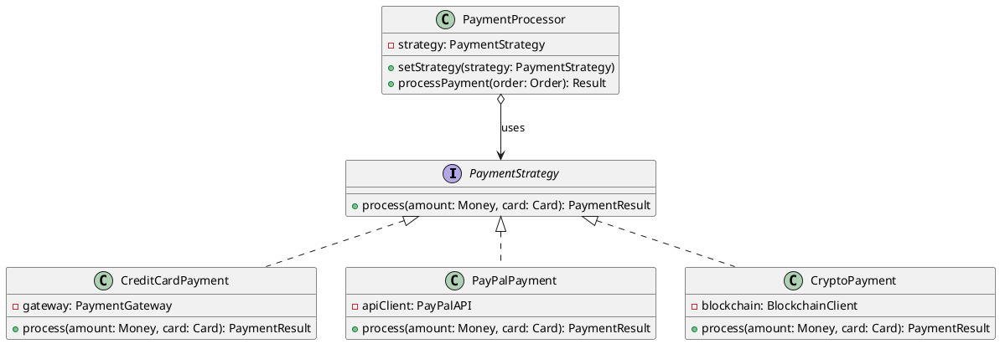

**Design Rationale**: 
- New payment methods can be added without modifying PaymentProcessor
- Payment logic is encapsulated in individual strategy classes
- Testing is simplified (mock strategies easily)
```

### Example 3: API Flow (Use Mermaid for Simple, PlantUML for Complex)

**Simple API Flow (Mermaid):**

```markdown
## Basic Authentication API Flow

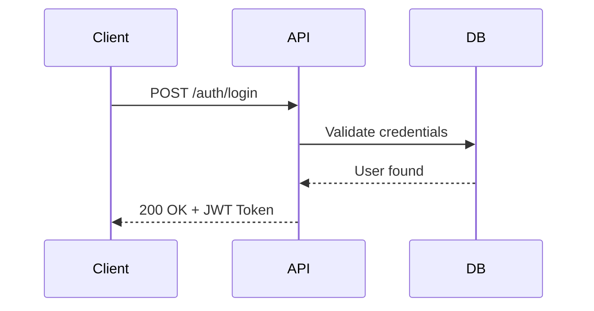
```

**Complex API Flow with Error Handling (PlantUML):**

```markdown
## Complete Authentication Flow with Error Handling

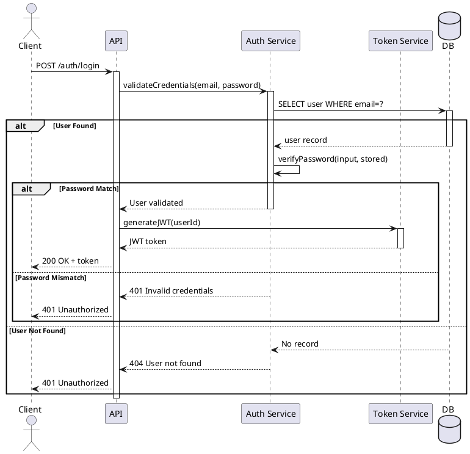
```

---

## Quick Reference Card

### When to Use What?

| What You Need | Tool | Diagram Type |
|---------------|------|--------------|
| Show process flow | Mermaid | Flowchart |
| Show user journey | Mermaid | User Journey |
| Simple API interaction | Mermaid | Sequence Diagram |
| Simple domain model | Mermaid | Class Diagram |
| Database schema | Mermaid | ER Diagram |
| Simple state machine | Mermaid | State Diagram |
| Project timeline | Mermaid | Gantt Chart |
| **Complex class hierarchy** | **PlantUML** | **Class Diagram** |
| **Detailed API with error handling** | **PlantUML** | **Sequence Diagram** |
| **System architecture** | **PlantUML** | **Component Diagram** |
| **Infrastructure/deployment** | **PlantUML** | **Deployment Diagram** |
| **Business process** | **PlantUML** | **Activity Diagram** |
| **Complex state machine** | **PlantUML** | **State Diagram** |

---

## Tools and Resources

### Mermaid Resources
- [Mermaid Live Editor](https://mermaid.live/)
- [Mermaid Documentation](https://mermaid.js.org/)
- [Mermaid Cheat Sheet](https://jojozhuang.github.io/tutorial/mermaid-cheat-sheet/)

### PlantUML Resources
- [PlantUML Online Editor](http://www.plantuml.com/plantuml/)
- [PlantUML Documentation](https://plantuml.com/)
- [Real World PlantUML](https://real-world-plantuml.com/)
- [PlantUML VS Code Extension](https://marketplace.visualstudio.com/items?itemName=jebbs.plantuml)

### Rendering in Documentation
- Both Mermaid and PlantUML are supported in GitHub markdown
- GitLab supports both natively
- For local viewing, use VS Code extensions or dedicated preview tools

---

**Remember**: The goal is **clear communication**, not perfect diagrams. Choose the tool and type that best conveys your message to your audience.
