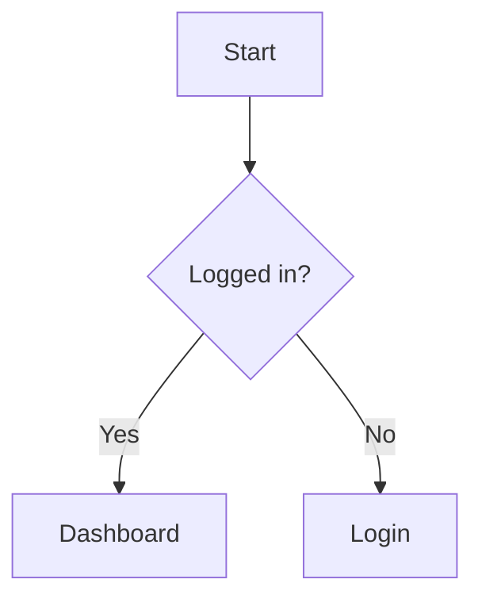
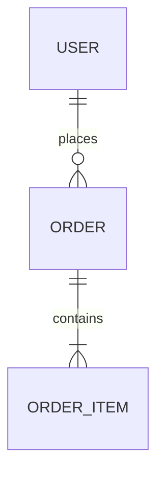
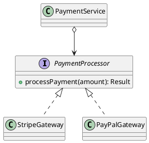
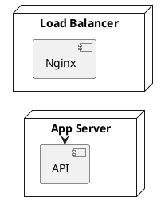
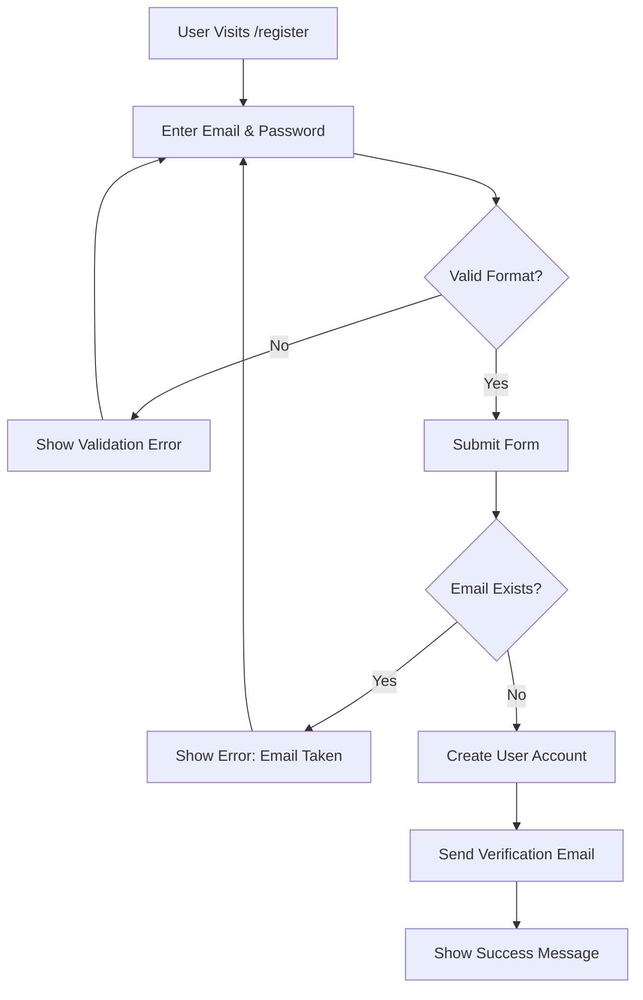
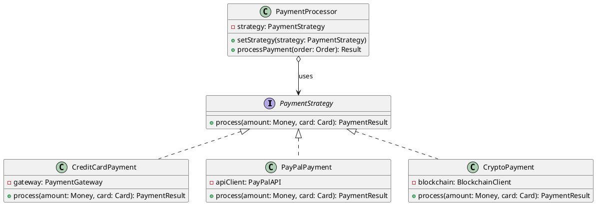
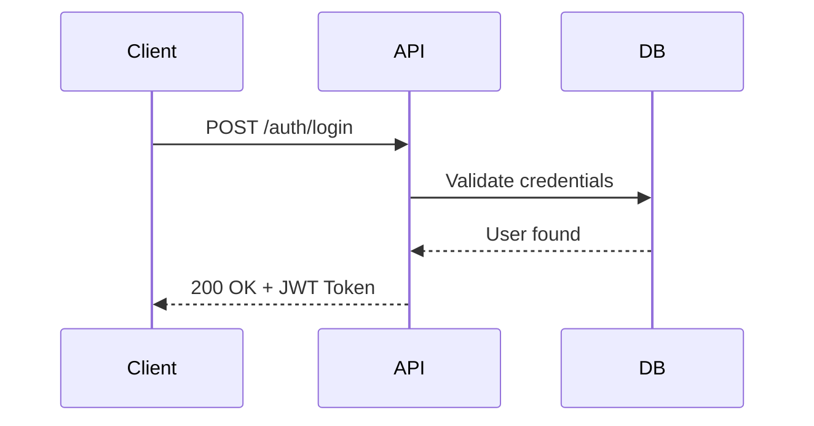
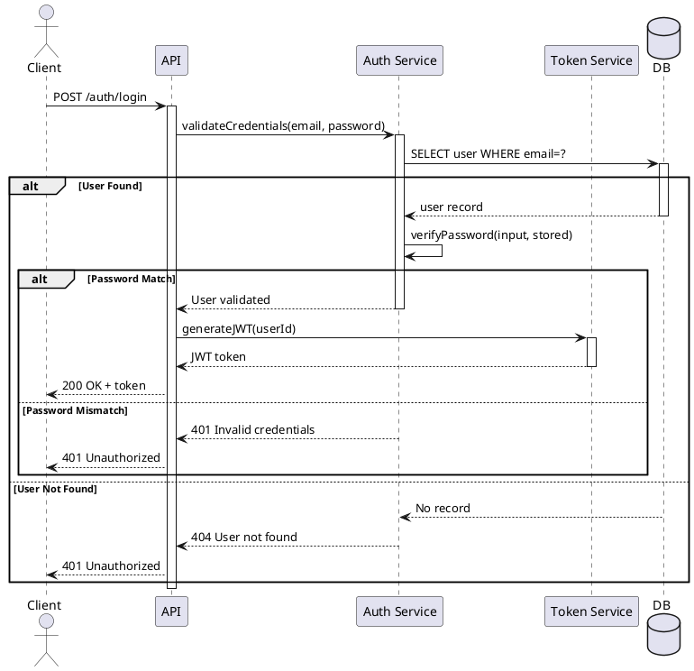

# Diagram Usage Guide

## Decision Matrix

| Diagram | Mermaid | PlantUML |
|---------|---------|----------|
| **Class** | < 5 classes | > 5 classes, complex |
| **Sequence** | Simple | Complex loops/conditions |
| **Flowchart** | All | — |
| **ER** | All | — |
| **Component/Deploy** | — | All |
| **User Journey/Gantt** | All | — |

**Rule**: Mermaid=simple, PlantUML=complex UML

## Mermaid Examples

**Flowchart**:


**ER Diagram**:



## PlantUML Examples

**Complex Class**:


**Deployment**:



## Best Practices

✓ One concept per diagram
✓ Consistent naming: Classes=PascalCase, methods=camelCase, DB=snake_case
✓ Label relationships
✓ Split complex diagrams
✗ Avoid unlabeled connections
✗ Don't mix diagram types

## Troubleshooting

**PlantUML not rendering**: Settings → `plantumlServer`: `https://kroki.io/plantuml/svg/`, reload window
**Java not found**: `brew install openjdk` / `sudo apt install default-jre`
**Syntax errors**: Test at [Mermaid Live](https://mermaid.live/) or [PlantUML Online](http://www.plantuml.com/plantuml/)

### Example 1: Simple Feature Documentation (Use Mermaid)

```markdown
## User Registration Flow

The user registration process follows these steps:



The user must verify their email before accessing the platform.
```

### Example 2: Complex Class Design (Use PlantUML)

```markdown
## Payment Processing Architecture

The payment system follows the Strategy pattern, allowing different 
payment processors to be used interchangeably:

---

## Troubleshooting

### PlantUML Issues

#### Error: "plantuml.jar file not found"

**Solution 1: Use Online Server (Quickest)**
1. Open VS Code Settings (`Cmd+,` or `Ctrl+,`)
2. Search: `markdown-preview-enhanced.plantumlServer`
3. Set to: `https://kroki.io/plantuml/svg/`
4. Reload VS Code window (`Cmd+Shift+P` → "Reload Window")

**Solution 2: Fix Local Path**
1. Verify plantuml.jar exists at the configured path
2. Use absolute path (not relative)
3. Check path in settings: `markdown-preview-enhanced.plantumlJarPath`
4. Ensure no typos in file path

#### Error: "Java not found" or "JAVA_HOME not set"

**macOS/Linux:**
```bash
# Check Java installation
java -version

# If not installed
brew install openjdk  # macOS
sudo apt install default-jre  # Ubuntu/Debian

# Set JAVA_HOME (add to ~/.zshrc or ~/.bashrc)
export JAVA_HOME=$(/usr/libexec/java_home)  # macOS
export JAVA_HOME=/usr/lib/jvm/default-java  # Linux
```

**Windows:**
1. Download Java from [java.com](https://www.java.com/download/)
2. Install and restart terminal
3. Verify: `java -version`

#### Diagrams Not Rendering in Preview

**Checklist:**
- [ ] Markdown Preview Enhanced extension installed
- [ ] Either plantumlServer OR plantumlJarPath configured (not both)
- [ ] VS Code window reloaded after configuration
- [ ] Correct code fence syntax (```plantuml, not ```uml)
- [ ] Diagram starts with `@startuml` and ends with `@enduml`

**Test Configuration:**
```bash
# Test if online server is accessible
curl https://kroki.io/plantuml/svg/

# Test if jar file works
java -jar ~/tools/plantuml/plantuml.jar -version
```

#### Slow Rendering (Online Server)

**Solutions:**
1. Switch to local plantuml.jar (faster for many diagrams)
2. Use a closer online server
3. Reduce diagram complexity
4. Cache diagrams locally after first render

#### Syntax Errors in Diagrams

**Common Issues:**
- Missing `@startuml` or `@enduml`
- Invalid UML syntax (check [PlantUML documentation](https://plantuml.com/))
- Unclosed strings or brackets
- Typos in relationship operators (`-->`, `->`, etc.)

**Debugging:**
1. Copy diagram to [PlantUML Online Editor](http://www.plantuml.com/plantuml/)
2. Check error messages
3. Simplify diagram to isolate issue
4. Verify syntax against examples

### Mermaid Issues

#### Diagrams Not Rendering

**Solutions:**
1. Verify Markdown Preview Enhanced installed
2. Check syntax at [Mermaid Live Editor](https://mermaid.live/)
3. Ensure correct code fence: ```mermaid
4. Reload VS Code window

#### Syntax Errors

**Common Issues:**
- Missing semicolons in older syntax
- Invalid node IDs (use quotes for spaces: `A["Node with spaces"]`)
- Wrong relationship operators
- Missing direction declaration (TD, LR, etc.) in flowcharts

**Debugging:**
1. Copy to [Mermaid Live Editor](https://mermaid.live/)
2. Check error console in browser dev tools
3. Simplify diagram step-by-step
4. Verify syntax against [Mermaid docs](https://mermaid.js.org/)

### GitHub/GitLab Rendering

Both platforms support Mermaid natively but have different PlantUML support:

**GitHub:**
- ✅ Mermaid: Renders automatically
- ❌ PlantUML: Not supported directly (use external service or images)

**GitLab:**
- ✅ Mermaid: Renders automatically  
- ✅ PlantUML: Renders automatically

**For GitHub PlantUML Support:**
Use Kroki.io proxy service:
```markdown

```

Generate URLs at: [Kroki Playground](https://kroki.io/)

### Performance Issues

**For Large Diagrams:**
1. Split into multiple focused diagrams
2. Use local rendering (plantuml.jar) instead of online
3. Reduce number of elements
4. Simplify relationships
5. Consider creating overview + detail diagrams

**Optimization Tips:**
- Limit class diagrams to 10-15 classes max
- Use packages/namespaces to group elements
- Avoid deeply nested structures
- Use notes sparingly

---

## Quick Setup Commands

### For macOS Users (Recommended: Online Server)

```bash
# Open VS Code settings.json
code ~/Library/Application\ Support/Code/User/settings.json

# Add this line:
# "markdown-preview-enhanced.plantumlServer": "https://kroki.io/plantuml/svg/"

# Reload VS Code
# Cmd+Shift+P → "Developer: Reload Window"
```

### For macOS Users (Local JAR Alternative)

```bash
# Install Java
brew install openjdk

# Download PlantUML
mkdir -p ~/tools/plantuml
curl -L -o ~/tools/plantuml/plantuml.jar \
  https://github.com/plantuml/plantuml/releases/download/v1.2024.8/plantuml-1.2024.8.jar

# Add to VS Code settings.json:
# "markdown-preview-enhanced.plantumlJarPath": "/Users/$(whoami)/tools/plantuml/plantuml.jar"

# Test
java -jar ~/tools/plantuml/plantuml.jar -version
```

### For Linux Users

```bash
# Install Java
sudo apt update && sudo apt install default-jre

# Download PlantUML
mkdir -p ~/tools/plantuml
cd ~/tools/plantuml
wget https://github.com/plantuml/plantuml/releases/download/v1.2024.8/plantuml-1.2024.8.jar -O plantuml.jar

# Configure VS Code (online server - easiest)
# Add to settings.json:
# "markdown-preview-enhanced.plantumlServer": "https://kroki.io/plantuml/svg/"
```

### For Windows Users

```powershell
# Install Java from java.com, then:

# Create directory
New-Item -Path "C:\tools\plantuml" -ItemType Directory -Force

# Download PlantUML (PowerShell)
Invoke-WebRequest -Uri "https://github.com/plantuml/plantuml/releases/download/v1.2024.8/plantuml-1.2024.8.jar" -OutFile "C:\tools\plantuml\plantuml.jar"

# Configure VS Code (online server recommended)
# Add to settings.json:
# "markdown-preview-enhanced.plantumlServer": "https://kroki.io/plantuml/svg/"
```

---

**Need Help?** Check the [Markdown Preview Enhanced documentation](https://shd101wyy.github.io/markdown-preview-enhanced/) or [PlantUML documentation](https://plantuml.com/).



**Design Rationale**: 
- New payment methods can be added without modifying PaymentProcessor
- Payment logic is encapsulated in individual strategy classes
- Testing is simplified (mock strategies easily)
```

### Example 3: API Flow (Use Mermaid for Simple, PlantUML for Complex)

**Simple API Flow (Mermaid):**

```markdown
## Basic Authentication API Flow


```

**Complex API Flow with Error Handling (PlantUML):**

```markdown
## Complete Authentication Flow with Error Handling


```

---

## Quick Reference Card

### When to Use What?

| What You Need | Tool | Diagram Type |
|---------------|------|--------------|
| Show process flow | Mermaid | Flowchart |
| Show user journey | Mermaid | User Journey |
| Simple API interaction | Mermaid | Sequence Diagram |
| Simple domain model | Mermaid | Class Diagram |
| Database schema | Mermaid | ER Diagram |
| Simple state machine | Mermaid | State Diagram |
| Project timeline | Mermaid | Gantt Chart |
| **Complex class hierarchy** | **PlantUML** | **Class Diagram** |
| **Detailed API with error handling** | **PlantUML** | **Sequence Diagram** |
| **System architecture** | **PlantUML** | **Component Diagram** |
| **Infrastructure/deployment** | **PlantUML** | **Deployment Diagram** |
| **Business process** | **PlantUML** | **Activity Diagram** |
| **Complex state machine** | **PlantUML** | **State Diagram** |

---

## Tools and Resources

### Mermaid Resources
- [Mermaid Live Editor](https://mermaid.live/)
- [Mermaid Documentation](https://mermaid.js.org/)
- [Mermaid Cheat Sheet](https://jojozhuang.github.io/tutorial/mermaid-cheat-sheet/)

### PlantUML Resources
- [PlantUML Online Editor](http://www.plantuml.com/plantuml/)
- [PlantUML Documentation](https://plantuml.com/)
- [Real World PlantUML](https://real-world-plantuml.com/)
- [PlantUML VS Code Extension](https://marketplace.visualstudio.com/items?itemName=jebbs.plantuml)

### Rendering in Documentation
- Both Mermaid and PlantUML are supported in GitHub markdown
- GitLab supports both natively
- For local viewing, use VS Code extensions or dedicated preview tools

---

**Remember**: The goal is **clear communication**, not perfect diagrams. Choose the tool and type that best conveys your message to your audience.
