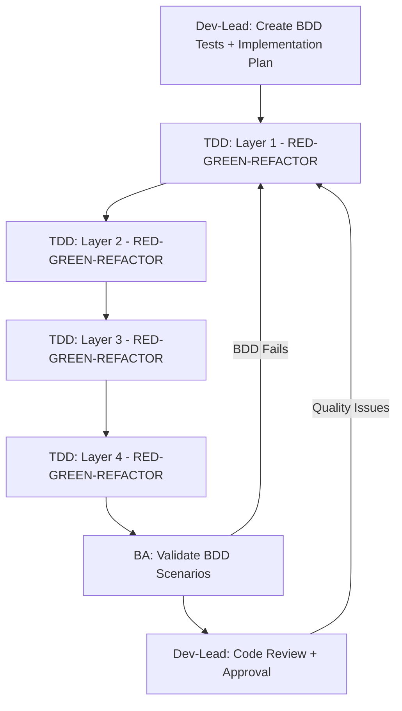

````markdown
# 🔴🟢🔄 TDD Enforcement Guide

## Why TDD Wasn't Followed (Issues Found)

1. **Missing Implementation Plans** - agents didn't know what to build layer-by-layer
2. **No BDD Entry Point** - failing tests didn't drive development  
3. **Agent Suggestions vs Action** - agents suggested TDD instead of doing TDD
4. **Layer Skipping** - agents tried to implement everything at once
5. **No RED-GREEN-REFACTOR Discipline** - cycles weren't enforced

## ✅ Correct TDD Workflow

### **Phase 2: BDD Integration (Dev-Lead Must Do This)**

```markdown
For EACH user story selected in sprint:

1. **Extract BDD Scenarios** from /docs/prd/user-stories.md
2. **Create Feature File**: features/auth/login.feature  
3. **Create Step Definitions**: with real API calls/assertions
4. **Run BDD Tests** → THEY FAIL (expected - no endpoints exist)
5. **Create Implementation Plan**: /docs/user-stories/US-001/implementation-plan.md

Implementation Plan Structure:
- Layer 1 (Database): Specific files to create, BDD assertions to satisfy
- Layer 2 (Backend): Specific files to create, BDD assertions to satisfy  
- Layer 3 (Config): Specific files to create, BDD assertions to satisfy
- Layer 4 (Frontend): Specific files to create, BDD assertions to satisfy
- Definition of Done: ALL BDD scenarios pass, coverage >80%, code review approved

6. **Hand off to TDD agents** with:
   - Failing BDD tests (entry point)
   - Implementation plan (roadmap)
   - "Make these BDD tests pass by following the implementation plan"
```

### **Phase 3: TDD Execution (TDD Agents Must Do This)**

```markdown
For EACH layer (Database → Backend → Config → Frontend):

🔴 **RED Phase**:
1. **Read Implementation Plan** for current layer  
2. **Run BDD tests** - see which assertions fail for this layer
3. **Write failing unit test** that supports BDD assertion
4. **Verify test fails** (RED)

🟢 **GREEN Phase**:  
1. **Implement minimal code** to make unit test pass
2. **Run unit test** - verify it passes
3. **Run BDD test** - check if layer's BDD assertions now pass
4. **If BDD still fails** - write next unit test (back to RED)
5. **If BDD passes for layer** - layer is complete (GREEN)

🔄 **REFACTOR Phase**:
1. **Improve code quality** (SOLID principles, clean code)
2. **Run all tests** - ensure they still pass
3. **Commit changes** with test results
4. **Move to next layer**

🚫 **DO NOT**:
- Skip layers (must go 1→2→3→4)
- Implement without tests
- Write multiple layers at once
- Suggest what to do - DO the work
- Move to next layer until BDD assertions pass
```

### **Enforcement Rules**

1. **BDD Tests are Entry Point** - failing tests drive what to build
2. **Implementation Plan is Roadmap** - guides what files to create per layer  
3. **Layer Sequence is Mandatory** - Database → Backend → Config → Frontend
4. **TDD Cycles are Required** - RED → GREEN → REFACTOR per layer
5. **BDD Validation is Exit Criteria** - all scenarios must pass before "In Review"

### **Agent Handoff Pattern**



## 🎯 Implementation Plan Template

```markdown
# Implementation Plan: US-001 (User Registration)

## Entry Point: Failing BDD Tests
- Feature File: features/auth/registration.feature
- Scenarios: 5 scenarios defined
- Current Status: 0/5 passing (all failing - expected)

## Layer 1 - Database (Make BDD database assertions pass)
**Files to Create**:
- migrations/001_create_users_table.sql  
- models/User.ts (validation, uniqueness)
- repositories/UserRepository.ts

**BDD Test Coverage** (which BDD assertions will pass):  
- "Given a valid email is provided" - database accepts email
- "When user registration is submitted" - user record created
- "Then email should be unique" - uniqueness constraint works

**TDD Approach**:
- RED: Test User model validations fail
- GREEN: Implement User model with email validation  
- REFACTOR: Clean up validation logic
- Verify: BDD database steps now pass

**Definition of Done for Layer 1**:
- User model validates email format ✓
- Database enforces email uniqueness ✓  
- BDD scenarios pass for user creation steps ✓

## Layer 2 - Backend (Make BDD API assertions pass)
**Files to Create**:
- controllers/AuthController.ts (registration endpoint)
- services/AuthService.ts (business logic)  
- dto/RegisterUserDto.ts (request validation)

**BDD Test Coverage**:
- "When POST /api/register is called" - endpoint exists
- "Then return 201 Created" - successful response  
- "Then return 400 Bad Request for invalid email" - validation response

**TDD Approach**:
- RED: Test registration endpoint returns 404 (doesn't exist)
- GREEN: Create endpoint that returns 201  
- RED: Test validation returns generic error
- GREEN: Implement proper validation with 400 responses
- REFACTOR: Extract business logic to service
- Verify: BDD API scenarios now pass

## Layer 3 - Configuration (Make BDD integration assertions pass)  
**Files to Create**:
- routes/auth.routes.ts (route registration)
- config/di-container.ts (dependency injection)
- middleware/validation.middleware.ts

**BDD Test Coverage**:
- "Given the application is running" - routes registered
- "When the registration endpoint is accessed" - routing works
- "Then middleware validates the request" - validation pipeline

## Layer 4 - Frontend (Make BDD UI assertions pass)
**Files to Create**:  
- components/RegistrationForm.tsx
- pages/register.tsx
- services/authApi.ts (API client)
- styles/registration.css (from design system)

**BDD Test Coverage**:
- "Given user visits registration page" - page renders
- "When user fills form and submits" - form submission works  
- "Then success message is displayed" - UI feedback

**Design Specifications**: 
- Use design tokens from /docs/design/design-systems.md
- Follow component hierarchy from design system
- Implement accessibility requirements (WCAG AA)

## Overall Definition of Done
- ✅ All 5 BDD scenarios passing (100%)
- ✅ Test coverage >80% across all layers  
- ✅ Code review approved (13-point checklist)
- ✅ No architectural violations
- ✅ Design system compliance verified
```

## 🚨 Failure Recovery

### **If TDD Agents Suggest Instead of Implement**:
```bash
# Wrong Agent Response:
"I suggest you implement the User model with email validation..."

# Correct Agent Response:  
[Creates file: models/User.ts with actual code]
[Runs tests and shows results]  
[Updates status: Layer 1 complete, BDD tests X/Y passing]
```

### **If Agents Skip TDD Cycles**:
```bash  
# Wrong: Agent implements entire feature at once
# Correct: Agent does RED-GREEN-REFACTOR for each layer
```

### **If BDD Tests Aren't Used as Entry Point**:
```bash
# Wrong: Agent starts coding without failing tests
# Correct: Agent runs BDD tests first, sees failures, implements to fix
```

## 📋 TDD Checklist for Agents

**Dev-Lead Agent (Phase 2)**:
- [ ] BDD scenarios extracted from user story
- [ ] Feature files created with step definitions  
- [ ] BDD tests run and fail (expected)
- [ ] Implementation plan created with layer breakdown
- [ ] Failing tests + plan handed off to TDD agents

**TDD Agents (Phase 3)**:  
- [ ] Implementation plan read for current layer
- [ ] BDD tests run to see current failures
- [ ] Unit test written that supports BDD assertion (RED)
- [ ] Minimal code implemented to pass unit test (GREEN)  
- [ ] Code refactored for quality (REFACTOR)
- [ ] BDD tests run to verify layer progress
- [ ] Layer marked complete only when BDD assertions pass
- [ ] Next layer started or story marked "In Review"

**BA Agent (Phase 4)**:
- [ ] All BDD scenarios executed in full environment  
- [ ] Real data and production-like setup used
- [ ] Story approved only if all BDD scenarios pass
- [ ] Feedback provided if any scenarios fail

This ensures **BDD-driven TDD** where failing acceptance tests drive the implementation, not developer assumptions.
````